# 版本
+ github: envoyproxy/ratelimit

# 序
## 组成
envoy的全局限流主要有两部分
1. envoy filter: 通过action设置给请求打上descriptor标签,然后将descriptor通过grpc请求发送给token server,根据token server返回的结果决定是否限流此请求
2. token server: 加载全局限流配置,接收envoy filter发来的请求(附带该请求的descriptor),比对请求descriptor与配置,决定是否限流

## 当前遇到的疑问
- 所有经过envoy得请求都需要向`外部`token server发送grpc请求,得到结果后才能决定过放不放行,在流量大时是否会导致延迟飙升? todo 待压力测试
- tokenserver(envoyproxy/ratelimit)
  - 每次请求都需要读写redis,会不会在这里形成瓶颈?
    - 已知优化1:合并每个请求的所有descriptor更新请求到一个pipeline中
    - 已知优化2:触发限流时生成本地缓存,直接返回限流状态,不再读写redis
  - 扩展性问题1,tokenserver服务器多了,对redis造成读写压力(todo,待测试,可能对redis造成压力的请求量级远大于tokenserver本身能接受的请求量级)
  - 扩展性问题2,redis cluster, 会不会因为造成读写redis延迟增大 todo
- tokenserver(sentinel) TODO

# envoy filter


# token server
## envoyproxy/ratelimit
### 流程图


### shouldRateLimitWorker 方法接受request的参数,返回这个request是否应该限流
```go
// src/service/ratelimit.go
func (this *service) shouldRateLimitWorker(
	ctx context.Context, request *pb.RateLimitRequest) *pb.RateLimitResponse {
    
    // 获取当前的全局限流配置
	snappedConfig, globalShadowMode := this.GetCurrentConfig()

    // 比对请求匹配了配置的哪些descriptor todo
	limitsToCheck, isUnlimited := this.constructLimitsToCheck(request, ctx, snappedConfig)

    // 检测请求匹配的每个descriptor是否触发了限流配置 #ref cache dolimit (redis)
	responseDescriptorStatuses := this.cache.DoLimit(ctx, request, limitsToCheck)

	response := &pb.RateLimitResponse{}
	response.Statuses = make([]*pb.RateLimitResponse_DescriptorStatus, len(request.Descriptors))
	finalCode := pb.RateLimitResponse_OK

	// Keep track of the descriptor which is closest to hit the ratelimit
	minLimitRemaining := MaxUint32
	var minimumDescriptor *pb.RateLimitResponse_DescriptorStatus = nil

	for i, descriptorStatus := range responseDescriptorStatuses {
		// Keep track of the descriptor closest to hit the ratelimit
		if this.customHeadersEnabled &&
			descriptorStatus.CurrentLimit != nil &&
			descriptorStatus.LimitRemaining < minLimitRemaining {
			minimumDescriptor = descriptorStatus
			minLimitRemaining = descriptorStatus.LimitRemaining
		}

		if isUnlimited[i] {
			response.Statuses[i] = &pb.RateLimitResponse_DescriptorStatus{
				Code:           pb.RateLimitResponse_OK,
				LimitRemaining: math.MaxUint32,
			}
		} else {
			response.Statuses[i] = descriptorStatus
			if descriptorStatus.Code == pb.RateLimitResponse_OVER_LIMIT {
				finalCode = descriptorStatus.Code

				minimumDescriptor = descriptorStatus
				minLimitRemaining = 0
			}
		}
	}

	// Add Headers if requested
	if this.customHeadersEnabled && minimumDescriptor != nil {
		response.ResponseHeadersToAdd = []*core.HeaderValue{
			this.rateLimitLimitHeader(minimumDescriptor),
			this.rateLimitRemainingHeader(minimumDescriptor),
			this.rateLimitResetHeader(minimumDescriptor),
		}
	}

	// If there is a global shadow_mode, it should always return OK
	if finalCode == pb.RateLimitResponse_OVER_LIMIT && globalShadowMode {
		finalCode = pb.RateLimitResponse_OK
		this.stats.GlobalShadowMode.Inc()
	}

	response.OverallCode = finalCode
	return response
}
```

#### cache dolimit (redis)
envoyproxy/ratelimit server默认使用redis作为缓存更新和获取限流信息
```go
// src/redis/fixed_cache_impl.go
func (this *fixedRateLimitCacheImpl) DoLimit(
	ctx context.Context,
	request *pb.RateLimitRequest,
	limits []*config.RateLimit) []*pb.RateLimitResponse_DescriptorStatus {
    // ...

	// 根据请求的descriptor生成cacheKey
    // 一个请求可能同时满足多个descriptor,需要给每一个descriptor生成key,分别计算每个descriptor的限流触发情况
	cacheKeys := this.baseRateLimiter.GenerateCacheKeys(request, limits, hitsAddend)

	isOverLimitWithLocalCache := make([]bool, len(request.Descriptors))
	results := make([]uint32, len(request.Descriptors))
	var pipeline, perSecondPipeline Pipeline

	for i, cacheKey := range cacheKeys {
		if cacheKey.Key == "" {
			continue
		}

		// 判断是否有这个descriptor意境触发限流的本地缓存,如果有的话就不需要再访问redis了,减轻redis压力
		if this.baseRateLimiter.IsOverLimitWithLocalCache(cacheKey.Key) {

			// ...
				isOverLimitWithLocalCache[i] = true
            // ...
			continue
		}

        // 设置向redis请求的超时时间
		expirationSeconds := utils.UnitToDivider(limits[i].Limit.Unit)
		if this.baseRateLimiter.ExpirationJitterMaxSeconds > 0 {
			expirationSeconds += this.baseRateLimiter.JitterRand.Int63n(this.baseRateLimiter.ExpirationJitterMaxSeconds)
		}

		// 如果每一个descriptor的限流信息都要于redis交互,怕扛不住,需要把所有命令通过redis提供的pipeline特性发送给redis服务
		if this.perSecondClient != nil && cacheKey.PerSecond {
            // 对最常用的PerSecond 限流再做了一层优化(复用一个redis链接)
			if perSecondPipeline == nil {
				perSecondPipeline = Pipeline{}
			}
            // 当前命令的结果会返回在 results[i]中,供后面比对是否已经超过限额
			pipelineAppend(this.perSecondClient, &perSecondPipeline, cacheKey.Key, hitsAddend, &results[i], expirationSeconds)
		} else {
			if pipeline == nil {
				pipeline = Pipeline{}
			}
			pipelineAppend(this.client, &pipeline, cacheKey.Key, hitsAddend, &results[i], expirationSeconds)
		}
	}

	// 整理每个descriptor的限流状态结果
	responseDescriptorStatuses := make([]*pb.RateLimitResponse_DescriptorStatus,
		len(request.Descriptors))
	for i, cacheKey := range cacheKeys {

		limitAfterIncrease := results[i]
		limitBeforeIncrease := limitAfterIncrease - hitsAddend
        // 准备好当前请求的limit值和配置的limit值信息
		limitInfo := limiter.NewRateLimitInfo(limits[i], limitBeforeIncrease, limitAfterIncrease, 0, 0)
        // 根据当前请求的limit和配置的limit信息返回限流状态(附带更新isOverLimitWithLocalCache值,当已经触发限流时下次请求不需要再访问redis,直接返回结果) #ref GetResponseDescriptorStatus
		responseDescriptorStatuses[i] = this.baseRateLimiter.GetResponseDescriptorStatus(cacheKey.Key,
			limitInfo, isOverLimitWithLocalCache[i], hitsAddend)

	}

	return responseDescriptorStatuses
}
```

##### GetResponseDescriptorStatus
根据descriptor的limit配置信息与当前descriptor更新redis后的状态信息算出是否触发限流,
在已经触发限流时,更新`isOverLimitWithLocalCache`
```go
// src/limiter/base_limiter.go
func (this *BaseRateLimiter) GetResponseDescriptorStatus(key string, limitInfo *LimitInfo,
	isOverLimitWithLocalCache bool, hitsAddend uint32) *pb.RateLimitResponse_DescriptorStatus {
	if key == "" {
		return this.generateResponseDescriptorStatus(pb.RateLimitResponse_OK,
			nil, 0)
	}
	var responseDescriptorStatus *pb.RateLimitResponse_DescriptorStatus
	over_limit := false
	if isOverLimitWithLocalCache { // 当前descriptor已经有本地的缓存记录表示已经限流了,直接设置限流结果
		over_limit = true
		limitInfo.limit.Stats.OverLimit.Add(uint64(hitsAddend))
		limitInfo.limit.Stats.OverLimitWithLocalCache.Add(uint64(hitsAddend))
		responseDescriptorStatus = this.generateResponseDescriptorStatus(pb.RateLimitResponse_OVER_LIMIT,
			limitInfo.limit.Limit, 0)
	} else { // 没有本地缓存表示已经限流时需根据配置值已经当前值比对产生是否限流的结论
		limitInfo.overLimitThreshold = limitInfo.limit.Limit.RequestsPerUnit
		limitInfo.nearLimitThreshold = uint32(math.Floor(float64(float32(limitInfo.overLimitThreshold) * this.nearLimitRatio)))
		if limitInfo.limitAfterIncrease > limitInfo.overLimitThreshold { // 触发限流!
			over_limit = true
			responseDescriptorStatus = this.generateResponseDescriptorStatus(pb.RateLimitResponse_OVER_LIMIT,
				limitInfo.limit.Limit, 0)

			this.checkOverLimitThreshold(limitInfo, hitsAddend)

			if this.localCache != nil {
				// 触发限流后给本地cache设置一个值,超时时间为限制的间隔时间
                // 注: 因为每个请求的key是会随着设置的间隔时间来分段的,不同间隔时间段key不同,不需担心按设置的间隔时间会导致本地缓存有效期过久
				err := this.localCache.Set([]byte(key), []byte{}, int(utils.UnitToDivider(limitInfo.limit.Limit.Unit)))
				// ...
			}
		} else { // 没有触发限流,正常返回
			responseDescriptorStatus = this.generateResponseDescriptorStatus(pb.RateLimitResponse_OK,
				limitInfo.limit.Limit, limitInfo.overLimitThreshold-limitInfo.limitAfterIncrease)

			// The limit is OK but we additionally want to know if we are near the limit.
			this.checkNearLimitThreshold(limitInfo, hitsAddend)
			limitInfo.limit.Stats.WithinLimit.Add(uint64(hitsAddend))
		}
	}

	// ...

	return responseDescriptorStatus
}
```
## sentinel rls TODO