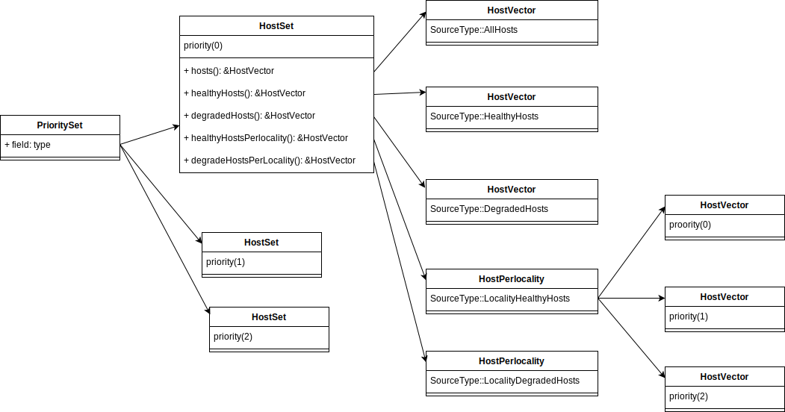

- [版本](#版本)
- [序](#序)
  - [与`ZoneAwareLoadBalancerBase`有关的的lb关系](#与zoneawareloadbalancerbase有关的的lb关系)
  - [host保存结构](#host保存结构)
    - [PrioritySet](#priorityset)
      - [PrioritySetImpl::updateHosts](#prioritysetimplupdatehosts)
    - [HostSet](#hostset)
      - [HostSetImpl::updateHosts](#hostsetimplupdatehosts)
    - [HostsPerlocality todo](#hostsperlocality-todo)
    - [HostVector todo](#hostvector-todo)
- [源码逻辑](#源码逻辑)
  - [接口](#接口)
  - [实现](#实现)
    - [RoundRobinLoadBalancer 创建](#roundrobinloadbalancer-创建)
      - [父类`EdfLoadBalancerBase`](#父类edfloadbalancerbase)
      - [EdfLoadBalancerBase::initialize()](#edfloadbalancerbaseinitialize)
      - [refresh(uint32\_t priority)](#refreshuint32_t-priority)
    - [ChooseHost](#choosehost)
      - [hostSourceToUse](#hostsourcetouse)
      - [hostSourceToHosts](#hostsourcetohosts)
      - [unweightedHostPick](#unweightedhostpick)
    - [host\_set的更新 todo](#host_set的更新-todo)


# 版本
+ github: envoyproxy/envoy
+ 分支:1.24.0-dev

# 序
ZoneAwareLoadBalancer 使envoy可以把流量优先转发到同region同zone的服务,减少网络损耗

## 与`ZoneAwareLoadBalancerBase`有关的的lb关系
- RandomLoadBalancer
- RoundRobinLoadBalancerBase
- LeastRequestLoadBalancer


## host保存结构
- 一个cluster拥有了一个`PrioritySet`
- 一个`PrioritySet`拥有若干个优先级不同的`HostSet`
- 一个`HostSet`拥有不同种类的`HostVector`或`HostsPerLocality`
  - SourceType::AllHosts
  - SourceType::HealthyHosts
  - SourceType::DegradedHosts
  - SourceType::LocalityHealthyHosts(`HostsPerLocality`)
  - SourceType::LocalityDegradedHosts(`HostsPerLocality`)
- `HostsPerLocality`中有若干个优先级不同的`HostVector`
- `HostVector`可以认为是一个host数组


### PrioritySet
```cpp
// source/common/upstream/upstream_impl.h
class PrioritySetImpl : public PrioritySet {
public:
  PrioritySetImpl() : batch_update_(false) {}
  // From PrioritySet
  ABSL_MUST_USE_RESULT Common::CallbackHandlePtr
  addMemberUpdateCb(MemberUpdateCb callback) const override {
    return member_update_cb_helper_.add(callback);
  }
  ABSL_MUST_USE_RESULT Common::CallbackHandlePtr
  addPriorityUpdateCb(PriorityUpdateCb callback) const override {
    return priority_update_cb_helper_.add(callback);
  }
  const std::vector<std::unique_ptr<HostSet>>& hostSetsPerPriority() const override {
    return host_sets_;
  }
  // Get the host set for this priority level, creating it if necessary.
  const HostSet&
  getOrCreateHostSet(uint32_t priority,
                     absl::optional<uint32_t> overprovisioning_factor = absl::nullopt);

  // 更新一个优先级的Host信息
  void updateHosts(uint32_t priority, UpdateHostsParams&& update_hosts_params,
                   LocalityWeightsConstSharedPtr locality_weights, const HostVector& hosts_added,
                   const HostVector& hosts_removed,
                   absl::optional<uint32_t> overprovisioning_factor = absl::nullopt,
                   HostMapConstSharedPtr cross_priority_host_map = nullptr) override;
}
```
#### PrioritySetImpl::updateHosts
- 入参
  - priority 要更新的优先级
  - 要更新的信息
```cpp
// source/common/upstream/upstream_impl.cc
void PrioritySetImpl::updateHosts(uint32_t priority, UpdateHostsParams&& update_hosts_params,
                                  LocalityWeightsConstSharedPtr locality_weights,
                                  const HostVector& hosts_added, const HostVector& hosts_removed,
                                  absl::optional<uint32_t> overprovisioning_factor,
                                  HostMapConstSharedPtr cross_priority_host_map) {
  // todo
  if (cross_priority_host_map != nullptr) {
    const_cross_priority_host_map_ = std::move(cross_priority_host_map);
  }

  // 根据参数priority找到‘HostSet’,调用‘HostSet’的updateHosts方法更新信息
  getOrCreateHostSet(priority, overprovisioning_factor);
  static_cast<HostSetImpl*>(host_sets_[priority].get())
      ->updateHosts(std::move(update_hosts_params), std::move(locality_weights), hosts_added,
                    hosts_removed, overprovisioning_factor);

  // todo
  if (!batch_update_) {
    runUpdateCallbacks(hosts_added, hosts_removed);
  }
}
```
### HostSet
一个`HostSet`包含了不同类型的`HostVector`
```cpp
// source/common/upstream/upstream_impl.h
class HostSetImpl : public HostSet {
public:
  HostSetImpl(uint32_t priority, absl::optional<uint32_t> overprovisioning_factor)
      : priority_(priority), overprovisioning_factor_(overprovisioning_factor.has_value()
                                                          ? overprovisioning_factor.value()
                                                          : kDefaultOverProvisioningFactor),
        hosts_(new HostVector()), healthy_hosts_(new HealthyHostVector()),
        degraded_hosts_(new DegradedHostVector()), excluded_hosts_(new ExcludedHostVector()) {}

  /**
   * Install a callback that will be invoked when the host set membership changes.
   * @param callback supplies the callback to invoke.
   * @return Common::CallbackHandlePtr the callback handle.
   */
  ABSL_MUST_USE_RESULT Common::CallbackHandlePtr
  addPriorityUpdateCb(PrioritySet::PriorityUpdateCb callback) const {
    return member_update_cb_helper_.add(callback);
  }

  // Upstream::HostSet
  const HostVector& hosts() const override { return *hosts_; }
  HostVectorConstSharedPtr hostsPtr() const override { return hosts_; }
  const HostVector& healthyHosts() const override { return healthy_hosts_->get(); }
  HealthyHostVectorConstSharedPtr healthyHostsPtr() const override { return healthy_hosts_; }
  const HostVector& degradedHosts() const override { return degraded_hosts_->get(); }
  DegradedHostVectorConstSharedPtr degradedHostsPtr() const override { return degraded_hosts_; }
  const HostVector& excludedHosts() const override { return excluded_hosts_->get(); }
  ExcludedHostVectorConstSharedPtr excludedHostsPtr() const override { return excluded_hosts_; }
  const HostsPerLocality& hostsPerLocality() const override { return *hosts_per_locality_; }
  HostsPerLocalityConstSharedPtr hostsPerLocalityPtr() const override {
    return hosts_per_locality_;
  }
  const HostsPerLocality& healthyHostsPerLocality() const override {
    return *healthy_hosts_per_locality_;
  }
  HostsPerLocalityConstSharedPtr healthyHostsPerLocalityPtr() const override {
    return healthy_hosts_per_locality_;
  }
  const HostsPerLocality& degradedHostsPerLocality() const override {
    return *degraded_hosts_per_locality_;
  }
  HostsPerLocalityConstSharedPtr degradedHostsPerLocalityPtr() const override {
    return degraded_hosts_per_locality_;
  }
  const HostsPerLocality& excludedHostsPerLocality() const override {
    return *excluded_hosts_per_locality_;
  }
  HostsPerLocalityConstSharedPtr excludedHostsPerLocalityPtr() const override {
    return excluded_hosts_per_locality_;
  }
  LocalityWeightsConstSharedPtr localityWeights() const override { return locality_weights_; }
  absl::optional<uint32_t> chooseHealthyLocality() override;
  absl::optional<uint32_t> chooseDegradedLocality() override;
  uint32_t priority() const override { return priority_; }
  uint32_t overprovisioningFactor() const override { return overprovisioning_factor_; }

  static PrioritySet::UpdateHostsParams
  updateHostsParams(HostVectorConstSharedPtr hosts,
                    HostsPerLocalityConstSharedPtr hosts_per_locality,
                    HealthyHostVectorConstSharedPtr healthy_hosts,
                    HostsPerLocalityConstSharedPtr healthy_hosts_per_locality,
                    DegradedHostVectorConstSharedPtr degraded_hosts,
                    HostsPerLocalityConstSharedPtr degraded_hosts_per_locality,
                    ExcludedHostVectorConstSharedPtr excluded_hosts,
                    HostsPerLocalityConstSharedPtr excluded_hosts_per_locality);
  static PrioritySet::UpdateHostsParams updateHostsParams(const HostSet& host_set);
  static PrioritySet::UpdateHostsParams
  partitionHosts(HostVectorConstSharedPtr hosts, HostsPerLocalityConstSharedPtr hosts_per_locality);

  // 更新Host信息
  void updateHosts(PrioritySet::UpdateHostsParams&& update_hosts_params,
                   LocalityWeightsConstSharedPtr locality_weights, const HostVector& hosts_added,
                   const HostVector& hosts_removed,
                   absl::optional<uint32_t> overprovisioning_factor = absl::nullopt);
}
```
#### HostSetImpl::updateHosts
```cpp
// source/common/upstream/upstream_impl.cc
void HostSetImpl::updateHosts(PrioritySet::UpdateHostsParams&& update_hosts_params,
                              LocalityWeightsConstSharedPtr locality_weights,
                              const HostVector& hosts_added, const HostVector& hosts_removed,
                              absl::optional<uint32_t> overprovisioning_factor) {
  if (overprovisioning_factor.has_value()) {
    ASSERT(overprovisioning_factor.value() > 0);
    overprovisioning_factor_ = overprovisioning_factor.value();
  }
  hosts_ = std::move(update_hosts_params.hosts);
  healthy_hosts_ = std::move(update_hosts_params.healthy_hosts);
  degraded_hosts_ = std::move(update_hosts_params.degraded_hosts);
  excluded_hosts_ = std::move(update_hosts_params.excluded_hosts);
  hosts_per_locality_ = std::move(update_hosts_params.hosts_per_locality);
  healthy_hosts_per_locality_ = std::move(update_hosts_params.healthy_hosts_per_locality);
  degraded_hosts_per_locality_ = std::move(update_hosts_params.degraded_hosts_per_locality);
  excluded_hosts_per_locality_ = std::move(update_hosts_params.excluded_hosts_per_locality);
  locality_weights_ = std::move(locality_weights);

  rebuildLocalityScheduler(healthy_locality_scheduler_, healthy_locality_entries_,
                           *healthy_hosts_per_locality_, healthy_hosts_->get(), hosts_per_locality_,
                           excluded_hosts_per_locality_, locality_weights_,
                           overprovisioning_factor_);
  rebuildLocalityScheduler(degraded_locality_scheduler_, degraded_locality_entries_,
                           *degraded_hosts_per_locality_, degraded_hosts_->get(),
                           hosts_per_locality_, excluded_hosts_per_locality_, locality_weights_,
                           overprovisioning_factor_);

  runUpdateCallbacks(hosts_added, hosts_removed);
}
```
### HostsPerlocality todo
### HostVector todo

# 源码逻辑
以 `RoundRobinLoadBalancerBase`为例子
## 接口
```cpp
// source/common/upstream/load_balancer_impl.h
class RoundRobinLoadBalancer : public EdfLoadBalancerBase {
public:
  // 创建‘RoundRobinLoadBalancer’
  RoundRobinLoadBalancer(
      const PrioritySet& priority_set, const PrioritySet* local_priority_set, ClusterStats& stats,
      Runtime::Loader& runtime, Random::RandomGenerator& random,
      const envoy::config::cluster::v3::Cluster::CommonLbConfig& common_config,
      const absl::optional<envoy::config::cluster::v3::Cluster::RoundRobinLbConfig>
          round_robin_config,
      TimeSource& time_source)
      : EdfLoadBalancerBase(
            priority_set, local_priority_set, stats, runtime, random, common_config,
            (round_robin_config.has_value() && round_robin_config.value().has_slow_start_config())
                ? absl::optional<envoy::config::cluster::v3::Cluster::SlowStartConfig>(
                      round_robin_config.value().slow_start_config())
                : absl::nullopt,
            time_source) {
    initialize();
  }

private:
  // 刷新一个存放host的容器信息
  void refreshHostSource(const HostsSource& source) override {
    rr_indexes_.insert({source, seed_});
    peekahead_index_ = 0;
  }
  double hostWeight(const Host& host) override {
    if (!noHostsAreInSlowStart()) {
      return applySlowStartFactor(host.weight(), host);
    }
    return host.weight();
  }

  HostConstSharedPtr unweightedHostPeek(const HostVector& hosts_to_use,
                                        const HostsSource& source) override {
    auto i = rr_indexes_.find(source);
    if (i == rr_indexes_.end()) {
      return nullptr;
    }
    return hosts_to_use[(i->second + (peekahead_index_)++) % hosts_to_use.size()];
  }

  HostConstSharedPtr unweightedHostPick(const HostVector& hosts_to_use,
                                        const HostsSource& source) override {
    if (peekahead_index_ > 0) {
      --peekahead_index_;
    }
    // To avoid storing the RR index in the base class, we end up using a second map here with
    // host source as the key. This means that each LB decision will require two map lookups in
    // the unweighted case. We might consider trying to optimize this in the future.
    ASSERT(rr_indexes_.find(source) != rr_indexes_.end());
    return hosts_to_use[rr_indexes_[source]++ % hosts_to_use.size()];
  }

  uint64_t peekahead_index_{};
  absl::node_hash_map<HostsSource, uint64_t, HostsSourceHash> rr_indexes_;
};
```
## 实现
### RoundRobinLoadBalancer 创建
```cpp
  // source/common/upstream/load_balancer_impl.cc
  RoundRobinLoadBalancer(
      const PrioritySet& priority_set, const PrioritySet* local_priority_set, ClusterStats& stats,
      Runtime::Loader& runtime, Random::RandomGenerator& random,
      const envoy::config::cluster::v3::Cluster::CommonLbConfig& common_config,
      const absl::optional<envoy::config::cluster::v3::Cluster::RoundRobinLbConfig>
          round_robin_config,
      TimeSource& time_source)
      : EdfLoadBalancerBase( // 调用父类’EdfLoadBalancerBase‘的创建 #ref EdfLoadBalancerBase
            priority_set, local_priority_set, stats, runtime, random, common_config,
            (round_robin_config.has_value() && round_robin_config.value().has_slow_start_config())
                ? absl::optional<envoy::config::cluster::v3::Cluster::SlowStartConfig>(
                      round_robin_config.value().slow_start_config())
                : absl::nullopt,
            time_source) {
    // 初始化当前‘cluster’的所有优先级的host设置 #ref EdfLoadBalancerBase::initialize()
    initialize();
  }
```
#### 父类`EdfLoadBalancerBase`
```cpp
// source/common/upstream/load_balancer_impl.cc
EdfLoadBalancerBase::EdfLoadBalancerBase(
    const PrioritySet& priority_set, const PrioritySet* local_priority_set, ClusterStats& stats,
    Runtime::Loader& runtime, Random::RandomGenerator& random,
    const envoy::config::cluster::v3::Cluster::CommonLbConfig& common_config,
    const absl::optional<envoy::config::cluster::v3::Cluster::SlowStartConfig> slow_start_config,
    TimeSource& time_source) // 父类‘ZoneAwareLoadBalancerBase’创建, 见下方‘ZoneAwareLoadBalancerBase::ZoneAwareLoadBalancerBase’
    : ZoneAwareLoadBalancerBase(priority_set, local_priority_set, stats, runtime, random,
                                common_config),
      seed_(random_.random()),
      //...
       {
  // ...
  // 给priority_set加上更新时的回调 todo 什么时候触发
  priority_update_cb_ = priority_set.addPriorityUpdateCb(
      [this](uint32_t priority, const HostVector&, const HostVector&) { refresh(priority); });
  // ...
}

ZoneAwareLoadBalancerBase::ZoneAwareLoadBalancerBase(
    const PrioritySet& priority_set, const PrioritySet* local_priority_set, ClusterStats& stats,
    Runtime::Loader& runtime, Random::RandomGenerator& random,
    const envoy::config::cluster::v3::Cluster::CommonLbConfig& common_config)
    : LoadBalancerBase(priority_set, stats, runtime, random, common_config),
      local_priority_set_(local_priority_set),
      routing_enabled_(PROTOBUF_PERCENT_TO_ROUNDED_INTEGER_OR_DEFAULT(
          common_config.zone_aware_lb_config(), routing_enabled, 100, 100)),
      min_cluster_size_(PROTOBUF_GET_WRAPPED_OR_DEFAULT(common_config.zone_aware_lb_config(),
                                                        min_cluster_size, 6U)),
      fail_traffic_on_panic_(common_config.zone_aware_lb_config().fail_traffic_on_panic()) {
  ASSERT(!priority_set.hostSetsPerPriority().empty());
  resizePerPriorityState();
  priority_update_cb_ = priority_set_.addPriorityUpdateCb(
      [this](uint32_t priority, const HostVector&, const HostVector&) -> void {
        // Update cross priority host map for fast host searching.
        cross_priority_host_map_ = priority_set_.crossPriorityHostMap();

        // Make sure per_priority_state_ is as large as priority_set_.hostSetsPerPriority()
        resizePerPriorityState();
        // If P=0 changes, regenerate locality routing structures. Locality based routing is
        // disabled at all other levels.
        if (local_priority_set_ && priority == 0) {
          regenerateLocalityRoutingStructures();
        }
      });
  if (local_priority_set_) {
    // Multiple priorities are unsupported for local priority sets.
    // In order to support priorities correctly, one would have to make some assumptions about
    // routing (all local Envoys fail over at the same time) and use all priorities when computing
    // the locality routing structure.
    ASSERT(local_priority_set_->hostSetsPerPriority().size() == 1);
    local_priority_set_member_update_cb_handle_ = local_priority_set_->addPriorityUpdateCb(
        [this](uint32_t priority, const HostVector&, const HostVector&) -> void {
          ASSERT(priority == 0);
          // If the set of local Envoys changes, regenerate routing for P=0 as it does priority
          // based routing.
          regenerateLocalityRoutingStructures();
        });
  }
}
```

#### EdfLoadBalancerBase::initialize()
遍历`priority_set_`所有优先级,调用`refresh`方法更新里面的内容
```cpp
// source/common/upstream/load_balancer_impl.cc
void EdfLoadBalancerBase::initialize() {
  // 遍历‘cluster’的每一个优先级
  for (uint32_t priority = 0; priority < priority_set_.hostSetsPerPriority().size(); ++priority) {
    // #ref refresh
    refresh(priority);
  }
}
```
#### refresh(uint32_t priority)
更新一个`priority_set_`的优先级的内容,将一个`PrioritySet`的内容按类别全部加入`schedule.edf_`,后续lb选择host时直接从edf_里获取
```cpp
// 刷新一个优先级(入参)的信息 
void EdfLoadBalancerBase::refresh(uint32_t priority) {
  // 创建一个‘add_hosts_source’函数将若干host放入指定的容器
  // 入参 source 是目标容器
  // 入参 hosts 是要放入目标的hosts们
  const auto add_hosts_source = [this](HostsSource source, const HostVector& hosts) {
    // 直接清空原有属于这个‘HostSource’的‘Scheduler’
    auto& scheduler = scheduler_[source] = Scheduler{};
    // 更新这个source容器的host信息, 这个是由继承了‘EdfLoadBalancerBase’类的‘RoundRobinLoadBalancer’来实现, #ref refreshHostSource
    refreshHostSource(source);
    // ...
    scheduler.edf_ = std::make_unique<EdfScheduler<const Host>>();

    // 遍历HostVector里的所有host并加入scheduler.edf_
    for (const auto& host : hosts) {
      scheduler.edf_->add(hostWeight(*host), host);
    }

    if (!hosts.empty()) {
      for (uint32_t i = 0; i < seed_ % hosts.size(); ++i) {
        auto host =
            // 初始化
            scheduler.edf_->pickAndAdd([this](const Host& host) { return hostWeight(host); });
      }
    }
    // ...
  };
  // 根据优先级‘priority’取出cluster在这个优先级的所有host信息
  const auto& host_set = priority_set_.hostSetsPerPriority()[priority];
  // 通过‘HostsSource’方法找到相应的容器,然后根据host类型放到当前优先级的相应容器
  add_hosts_source(HostsSource(priority, HostsSource::SourceType::AllHosts), host_set->hosts());
  add_hosts_source(HostsSource(priority, HostsSource::SourceType::HealthyHosts),
                   host_set->healthyHosts());
  add_hosts_source(HostsSource(priority, HostsSource::SourceType::DegradedHosts),
                   host_set->degradedHosts());
  // 遍历每一个优先级的‘healthyHostsPerLocality’里的host,把ta们按顺序放到当前优先级的‘LocalityHealthyHosts’容器里
  for (uint32_t locality_index = 0;
       locality_index < host_set->healthyHostsPerLocality().get().size(); ++locality_index) {
    add_hosts_source(
        HostsSource(priority, HostsSource::SourceType::LocalityHealthyHosts, locality_index),
        host_set->healthyHostsPerLocality().get()[locality_index]);
  }
  for (uint32_t locality_index = 0;
       locality_index < host_set->degradedHostsPerLocality().get().size(); ++locality_index) {
    add_hosts_source(
        HostsSource(priority, HostsSource::SourceType::LocalityDegradedHosts, locality_index),
        host_set->degradedHostsPerLocality().get()[locality_index]);
  }
}


void refreshHostSource(const HostsSource& source) override {
    // insert() is used here on purpose so that we don't overwrite the index if the host source
    // already exists. Note that host sources will never be removed, but given how uncommon this
    // is it probably doesn't matter.
    rr_indexes_.insert({source, seed_});
    // If the list of hosts changes, the order of picks change. Discard the
    // index.
    peekahead_index_ = 0;
  }

```
### ChooseHost
lb通过`chooseHost`方法根据`context`挑选出目标`host`
```cpp
// source/common/upstream/load_balancer_impl.cc
HostConstSharedPtr ZoneAwareLoadBalancerBase::chooseHost(LoadBalancerContext* context) {
  // todo
  HostConstSharedPtr host = LoadBalancerContextBase::selectOverrideHost(
      cross_priority_host_map_.get(), override_host_status_, context);
  if (host != nullptr) {
    return host;
  }

  const size_t max_attempts = context ? context->hostSelectionRetryCount() + 1 : 1;
  for (size_t i = 0; i < max_attempts; ++i) {
    // #ref chooseHostOnce
    host = chooseHostOnce(context);

    // If host selection failed or the host is accepted by the filter, return.
    // Otherwise, try again.
    // Note: in the future we might want to allow retrying when chooseHostOnce returns nullptr.
    if (!host || !context || !context->shouldSelectAnotherHost(*host)) {
      return host;
    }
  }

  // If we didn't find anything, return the last host.
  return host;
}

HostConstSharedPtr EdfLoadBalancerBase::chooseHostOnce(LoadBalancerContext* context) {
  // 调用hostSourceToUse方法根据context得到一个‘HostSource’结构实例,后面需要根据这个结构实例的信息确认从哪个具体HostVector里获取host
  // #ref hostSourceToUse todo
  const absl::optional<HostsSource> hosts_source = hostSourceToUse(context, random(false));
  // ...
  // 根据‘hosts_source’信息从’schedule_‘找到相应‘scheduler’ todo
  auto scheduler_it = scheduler_.find(*hosts_source);
  auto& scheduler = scheduler_it->second;

  if (scheduler.edf_ != nullptr) {
    // 配置了加权
    auto host = scheduler.edf_->pickAndAdd([this](const Host& host) { return hostWeight(host); });
    return host;
  } else { // 没有配置加权时
    // 根据‘hosts_source’信息,找到最终要使用的‘HostVector’ todo
    // #ref hostSourceToHosts
    const HostVector& hosts_to_use = hostSourceToHosts(*hosts_source);
    if (hosts_to_use.empty()) {
      return nullptr;
    }
    // 从‘HostVector’中取出一个最终的host
    // #ref unweightedHostPick
    return unweightedHostPick(hosts_to_use, *hosts_source);
  }
}
```
#### hostSourceToUse
```cpp
// source/common/upstream/load_balancer_impl.cc
absl::optional<ZoneAwareLoadBalancerBase::HostsSource>
ZoneAwareLoadBalancerBase::hostSourceToUse(LoadBalancerContext* context, uint64_t hash) const {
  // 按优先级选出prioritySet里的HostSet,以及set的健康状态
  auto host_set_and_source = chooseHostSet(context, hash);

  // The second argument tells us which availability we should target from the selected host set.
  const auto host_availability = host_set_and_source.second;
  auto& host_set = host_set_and_source.first;

  // 构造要返回的‘HostSource’实例
  HostsSource hosts_source;
  hosts_source.priority_ = host_set.priority(); // 填入priority信息

  // ...

  // 判断是否存在locality相关的设置
  // 最终返回locality是 'HostsPerLocality'的优先级index
  absl::optional<uint32_t> locality;
  if (host_availability == HostAvailability::Degraded) {
    locality = host_set.chooseDegradedLocality();
  } else {
    locality = host_set.chooseHealthyLocality();
  }
  // 如果存在locality设置,需要对hosts_source做些调整
  if (locality.has_value()) {
    // 转换SourceType类型
    // HostAvailability::Healthy ==》 HostsSource::SourceType::LocalityHealthyHosts
    // HostAvailability::Degraded ==》 HostsSource::SourceType::LocalityDegradedHosts
    auto source_type = localitySourceType(host_availability);
    if (!source_type) {
      return absl::nullopt;
    }
    // 设定source_type_ 和 locality_index_ 属性并返回
    hosts_source.source_type_ = source_type.value();
    hosts_source.locality_index_ = locality.value();
    return hosts_source;
  }
  // 其他非locality的情况
  // ...
}
```
#### hostSourceToHosts
入参`HostsSource`,根据`HostsSource`信息从host_set里找到并返回对应的`HostVector`
```cpp
// source/common/upstream/load_balancer_impl.cc
const HostVector& ZoneAwareLoadBalancerBase::hostSourceToHosts(HostsSource hosts_source) const {
  const HostSet& host_set = *priority_set_.hostSetsPerPriority()[hosts_source.priority_];
  switch (hosts_source.source_type_) {
  case HostsSource::SourceType::AllHosts:
    return host_set.hosts();
  case HostsSource::SourceType::HealthyHosts:
    return host_set.healthyHosts();
  case HostsSource::SourceType::DegradedHosts:
    return host_set.degradedHosts();
  case HostsSource::SourceType::LocalityHealthyHosts:
    return host_set.healthyHostsPerLocality().get()[hosts_source.locality_index_];
  case HostsSource::SourceType::LocalityDegradedHosts:
    return host_set.degradedHostsPerLocality().get()[hosts_source.locality_index_];
  }
  PANIC_DUE_TO_CORRUPT_ENUM;
}
```
#### unweightedHostPick
入参 `HostVector`, 随机返回一个host
```cpp
// source/common/upstream/load_balancer_impl.cc
HostConstSharedPtr LeastRequestLoadBalancer::unweightedHostPick(const HostVector& hosts_to_use,
                                                                const HostsSource&) {
  HostSharedPtr candidate_host = nullptr;
  // 随机挑一个host
  for (uint32_t choice_idx = 0; choice_idx < choice_count_; ++choice_idx) {
    const int rand_idx = random_.random() % hosts_to_use.size();
    HostSharedPtr sampled_host = hosts_to_use[rand_idx];

    if (candidate_host == nullptr) {

      // Make a first choice to start the comparisons.
      candidate_host = sampled_host;
      continue;
    }

    const auto candidate_active_rq = candidate_host->stats().rq_active_.value();
    const auto sampled_active_rq = sampled_host->stats().rq_active_.value();
    if (sampled_active_rq < candidate_active_rq) {
      candidate_host = sampled_host;
    }
  }

  return candidate_host;
}
```
### host_set的更新 todo
