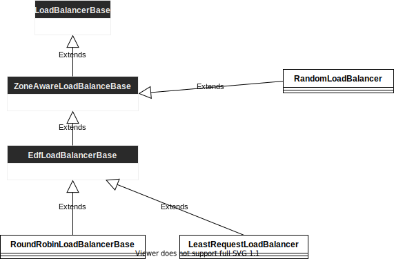

- [版本](#版本)
- [序](#序)
- [与`ZoneAwareLoadBalancerBase`有关的的lb](#与zoneawareloadbalancerbase有关的的lb)
- [源码逻辑](#源码逻辑)
  - [接口](#接口)
  - [实现](#实现)
    - [RoundRobinLoadBalancer 创建](#roundrobinloadbalancer-创建)
    - [ChooseHost todo](#choosehost-todo)
    - [host\_set的更新 todo](#host_set的更新-todo)


# 版本
+ github: envoyproxy/envoy
+ 分支:1.24.0-dev

# 序
ZoneAwareLoadBalancer 使envoy可以把流量优先转发到同region同zone的服务,减少网络损耗

# 与`ZoneAwareLoadBalancerBase`有关的的lb
- RandomLoadBalancer
- RoundRobinLoadBalancerBase
- LeastRequestLoadBalancer


# 源码逻辑
以 `RoundRobinLoadBalancerBase`为例子
## 接口
```cpp
// source/common/upstream/load_balancer_impl.h
class RoundRobinLoadBalancer : public EdfLoadBalancerBase {
public:
  // 创建‘RoundRobinLoadBalancer’
  RoundRobinLoadBalancer(
      const PrioritySet& priority_set, const PrioritySet* local_priority_set, ClusterStats& stats,
      Runtime::Loader& runtime, Random::RandomGenerator& random,
      const envoy::config::cluster::v3::Cluster::CommonLbConfig& common_config,
      const absl::optional<envoy::config::cluster::v3::Cluster::RoundRobinLbConfig>
          round_robin_config,
      TimeSource& time_source)
      : EdfLoadBalancerBase(
            priority_set, local_priority_set, stats, runtime, random, common_config,
            (round_robin_config.has_value() && round_robin_config.value().has_slow_start_config())
                ? absl::optional<envoy::config::cluster::v3::Cluster::SlowStartConfig>(
                      round_robin_config.value().slow_start_config())
                : absl::nullopt,
            time_source) {
    initialize();
  }

private:
  // 刷新一个存放host的容器信息
  void refreshHostSource(const HostsSource& source) override {
    rr_indexes_.insert({source, seed_});
    peekahead_index_ = 0;
  }
  double hostWeight(const Host& host) override {
    if (!noHostsAreInSlowStart()) {
      return applySlowStartFactor(host.weight(), host);
    }
    return host.weight();
  }

  HostConstSharedPtr unweightedHostPeek(const HostVector& hosts_to_use,
                                        const HostsSource& source) override {
    auto i = rr_indexes_.find(source);
    if (i == rr_indexes_.end()) {
      return nullptr;
    }
    return hosts_to_use[(i->second + (peekahead_index_)++) % hosts_to_use.size()];
  }

  HostConstSharedPtr unweightedHostPick(const HostVector& hosts_to_use,
                                        const HostsSource& source) override {
    if (peekahead_index_ > 0) {
      --peekahead_index_;
    }
    // To avoid storing the RR index in the base class, we end up using a second map here with
    // host source as the key. This means that each LB decision will require two map lookups in
    // the unweighted case. We might consider trying to optimize this in the future.
    ASSERT(rr_indexes_.find(source) != rr_indexes_.end());
    return hosts_to_use[rr_indexes_[source]++ % hosts_to_use.size()];
  }

  uint64_t peekahead_index_{};
  absl::node_hash_map<HostsSource, uint64_t, HostsSourceHash> rr_indexes_;
};
```
## 实现
### RoundRobinLoadBalancer 创建
```cpp
  // source/common/upstream/load_balancer_impl.cc
  RoundRobinLoadBalancer(
      const PrioritySet& priority_set, const PrioritySet* local_priority_set, ClusterStats& stats,
      Runtime::Loader& runtime, Random::RandomGenerator& random,
      const envoy::config::cluster::v3::Cluster::CommonLbConfig& common_config,
      const absl::optional<envoy::config::cluster::v3::Cluster::RoundRobinLbConfig>
          round_robin_config,
      TimeSource& time_source)
      : EdfLoadBalancerBase( // 调用父类’EdfLoadBalancerBase‘的创建 todo EdfLoadBalancerBase
            priority_set, local_priority_set, stats, runtime, random, common_config,
            (round_robin_config.has_value() && round_robin_config.value().has_slow_start_config())
                ? absl::optional<envoy::config::cluster::v3::Cluster::SlowStartConfig>(
                      round_robin_config.value().slow_start_config())
                : absl::nullopt,
            time_source) {
    // 初始化当前‘cluster’的所有优先级的host设置 #ref initialize
    initialize();
  }

// 初始化所有优先级的host设置
void EdfLoadBalancerBase::initialize() {
  // 遍历‘cluster’的每一个优先级
  for (uint32_t priority = 0; priority < priority_set_.hostSetsPerPriority().size(); ++priority) {
    // #ref refresh
    refresh(priority);
  }
}

// 刷新一个优先级(入参)的信息 
void EdfLoadBalancerBase::refresh(uint32_t priority) {
  // 创建一个‘add_hosts_source’函数将若干host放入指定的容器
  // 入参 source 是目标容器
  // 入参 hosts 是要放入目标的hosts们
  const auto add_hosts_source = [this](HostsSource source, const HostVector& hosts) {
    // 直接清空原有的source
    auto& scheduler = scheduler_[source] = Scheduler{};
    // 更新这个source容器的host信息, 这个是由继承了‘EdfLoadBalancerBase’类的‘RoundRobinLoadBalancer’来实现, #ref refreshHostSource
    refreshHostSource(source);
    // todo
    if (isSlowStartEnabled()) {
      recalculateHostsInSlowStart(hosts);
    }

    // 没有配置百分比分配流量时,直接跳过edf机制创建,因为有更省资源的方式实现 todo
    if (hostWeightsAreEqual(hosts) && noHostsAreInSlowStart()) {
      // Skip edf creation.
      return;
    }
    // ...
  };
  // 根据优先级‘priority’取出cluster在这个优先级的所有host信息
  const auto& host_set = priority_set_.hostSetsPerPriority()[priority];
  // 通过‘HostsSource’方法找到相应的容器,然后根据host类型放到当前优先级的相应容器
  add_hosts_source(HostsSource(priority, HostsSource::SourceType::AllHosts), host_set->hosts());
  add_hosts_source(HostsSource(priority, HostsSource::SourceType::HealthyHosts),
                   host_set->healthyHosts());
  add_hosts_source(HostsSource(priority, HostsSource::SourceType::DegradedHosts),
                   host_set->degradedHosts());
  // 遍历每一个优先级的‘healthyHostsPerLocality’里的host,把ta们按顺序放到当前优先级的‘LocalityHealthyHosts’容器里
  for (uint32_t locality_index = 0;
       locality_index < host_set->healthyHostsPerLocality().get().size(); ++locality_index) {
    add_hosts_source(
        HostsSource(priority, HostsSource::SourceType::LocalityHealthyHosts, locality_index),
        host_set->healthyHostsPerLocality().get()[locality_index]);
  }
  for (uint32_t locality_index = 0;
       locality_index < host_set->degradedHostsPerLocality().get().size(); ++locality_index) {
    add_hosts_source(
        HostsSource(priority, HostsSource::SourceType::LocalityDegradedHosts, locality_index),
        host_set->degradedHostsPerLocality().get()[locality_index]);
  }
}


void refreshHostSource(const HostsSource& source) override {
    // insert() is used here on purpose so that we don't overwrite the index if the host source
    // already exists. Note that host sources will never be removed, but given how uncommon this
    // is it probably doesn't matter.
    rr_indexes_.insert({source, seed_});
    // If the list of hosts changes, the order of picks change. Discard the
    // index.
    peekahead_index_ = 0;
  }

```
### ChooseHost todo
### host_set的更新 todo
