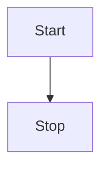

## 版本
+ Github:kubernetes/client-go
+ 分支: release-1.23

## 数据流向 todo
 


## 数据流向过程(反向)
以endpoint举例
### Lister
本地获取信息是通过Lister接口
```go
// listers/core/v1/endpoints.go
type EndpointsLister interface {
	// List 方法获取Endpoint列表
	List(selector labels.Selector) (ret []*v1.Endpoints, err error)

	// Endpoints 方法通过(namespace)缩小Lister检索数据的范围 todo
	Endpoints(namespace string) EndpointsNamespaceLister
	EndpointsListerExpansion //用于扩展
}

// endpointsLister 结构包含了一个cache,数据存在了cache里,获取数据时需要把这个cache传入函数里
type endpointsLister struct {
	indexer cache.Indexer
}

func (s *endpointsLister) List(selector labels.Selector) (ret []*v1.Endpoints, err error) {
    // 从‘cache’遍历,找到满足selector条件的endpoint,加入到要返回的结果中
    // s.indexer选取正确的 ‘子cache’,
	err = cache.ListAll(s.indexer, selector, func(m interface{}) {
		ret = append(ret, m.(*v1.Endpoints))
	})
	return ret, err
}
```

### cache
cache工具包提供ListAll函数, 函数中需要传入实际存数据的载体store, 过滤器selector, 以及过滤到想要的数据时的回调函数appendFn
```go
// tools/cache/listers.go
func ListAll(store Store, selector labels.Selector, appendFn AppendFunc) error {
	selectAll := selector.Empty() // selector为空时获取所有
	for _, m := range store.List() { //调用store的List方法,遍历所有item,选取满足条件的item,通过appendFn回调放入结果集
		if selectAll {
			// selectAll 省掉后面的过滤过程,直接调用appendFn回调
			appendFn(m)
			continue
		}
		metadata, err := meta.Accessor(m) // 获取item的meta信息(比如label就包含在这里),selector中需要的label信息就在这里
		if err != nil {
			return err
		}
		if selector.Matches(labels.Set(metadata.GetLabels())) { // 对满足过滤条件的item调用appendFn回调
			appendFn(m)
		}
	}
	return nil
}
```

### Store
#### interface
Store是存数据的单元的interface,需要提供一系列接口方法增删改查里面的数据
```go
// tools/cache/store.go
type Store interface {
	Add(obj interface{}) error //增

	Update(obj interface{}) error // 改

	Delete(obj interface{}) error // 删

    // 查
	List() []interface{} 
	ListKeys() []string
	Get(obj interface{}) (item interface{}, exists bool, err error)
	GetByKey(key string) (item interface{}, exists bool, err error)

	// ...
}
```

#### 实例
cache 是实现了 Store的真正存数据的实例
```go
type cache struct {
	// 如其名,内部封装了一个线程安全的Store实例, 调用的增删改查最终调用的是这个cacheStorage的增删改查方法
	cacheStorage ThreadSafeStore
	// 生成object的key的函数,需要外部定义并传进来
	keyFunc KeyFunc
}

// NewStore新建并返回一个Store实例,调用方需要把生成key的函数当成参数传进来
func NewStore(keyFunc KeyFunc) Store {
	return &cache{
		cacheStorage: NewThreadSafeStore(Indexers{}, Indices{}),
		keyFunc:      keyFunc,
	}
}

func (c *cache) Add(obj interface{}) error {
	key, err := c.keyFunc(obj)
	if err != nil {
		return KeyError{obj, err}
	}
	c.cacheStorage.Add(key, obj)
	return nil
}

func (c *cache) Update(obj interface{}) error {
	key, err := c.keyFunc(obj)
	if err != nil {
		return KeyError{obj, err}
	}
	c.cacheStorage.Update(key, obj)
	return nil
}

func (c *cache) Delete(obj interface{}) error {
	key, err := c.keyFunc(obj)
	if err != nil {
		return KeyError{obj, err}
	}
	c.cacheStorage.Delete(key)
	return nil
}

func (c *cache) List() []interface{} {
	return c.cacheStorage.List()
}
```

