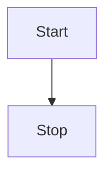

## 版本
+ Github:kubernetes/client-go
+ 分支: release-1.23

## 数据流向 todo
 informer 相当于把响应客户端获取数据请求(Lister) 与 从集群拿数据(Informer)两部分分离


## 客户端获取数据的过程
以endpoint举例
### Lister
本地获取信息是通过Lister接口
```go
// listers/core/v1/endpoints.go
type EndpointsLister interface {
	// List 方法获取Endpoint列表
	List(selector labels.Selector) (ret []*v1.Endpoints, err error)

	// Endpoints 方法通过(namespace)缩小Lister检索数据的范围 todo
	Endpoints(namespace string) EndpointsNamespaceLister
	EndpointsListerExpansion //用于扩展
}

// endpointsLister 结构包含了一个cache,数据存在了cache里,获取数据时需要把这个cache传入函数里
type endpointsLister struct {
	indexer cache.Indexer
}

func (s *endpointsLister) List(selector labels.Selector) (ret []*v1.Endpoints, err error) {
    // cache工具包从s.indexer里遍历,找到满足selector条件的endpoint,加入到要返回的结果中
	err = cache.ListAll(s.indexer, selector, func(m interface{}) {
		ret = append(ret, m.(*v1.Endpoints))
	})
	return ret, err
}
```

### cache
cache工具包提供ListAll函数, 函数中需要传入实际存数据的载体store, 过滤器selector, 以及过滤到想要的数据时的回调函数appendFn
```go
// tools/cache/listers.go
func ListAll(store Store, selector labels.Selector, appendFn AppendFunc) error {
	selectAll := selector.Empty() // selector为空时获取所有
	for _, m := range store.List() { //调用store的List方法,遍历所有item,选取满足条件的item,通过appendFn回调放入结果集
		if selectAll {
			// selectAll 省掉后面的过滤过程,直接调用appendFn回调
			appendFn(m)
			continue
		}
		metadata, err := meta.Accessor(m) // 获取item的meta信息(比如label就包含在这里),selector中需要的label信息就在这里
		if err != nil {
			return err
		}
		if selector.Matches(labels.Set(metadata.GetLabels())) { // 对满足过滤条件的item调用appendFn回调
			appendFn(m)
		}
	}
	return nil
}
```

### Store
#### interface
Store是存数据的单元的interface,需要提供一系列接口方法增删改查里面的数据
```go
// tools/cache/store.go
type Store interface {
	Add(obj interface{}) error //增

	Update(obj interface{}) error // 改

	Delete(obj interface{}) error // 删

    // 查
	List() []interface{} 
	ListKeys() []string
	Get(obj interface{}) (item interface{}, exists bool, err error)
	GetByKey(key string) (item interface{}, exists bool, err error)

	// ...
}
```

#### 实例
cache 是实现了 Store的真正存数据的实例
```go
type cache struct {
	// 如其名,内部封装了一个线程安全的Store实例, 调用的增删改查最终调用的是这个cacheStorage的增删改查方法
	cacheStorage ThreadSafeStore
	// 生成object的key的函数,需要外部定义并传进来
	keyFunc KeyFunc
}

// NewStore新建并返回一个Store实例,调用方需要把生成key的函数当成参数传进来
func NewStore(keyFunc KeyFunc) Store {
	return &cache{
		cacheStorage: NewThreadSafeStore(Indexers{}, Indices{}),
		keyFunc:      keyFunc,
	}
}

func (c *cache) Add(obj interface{}) error {
	key, err := c.keyFunc(obj)
	if err != nil {
		return KeyError{obj, err}
	}
	c.cacheStorage.Add(key, obj)
	return nil
}

func (c *cache) Update(obj interface{}) error {
	key, err := c.keyFunc(obj)
	if err != nil {
		return KeyError{obj, err}
	}
	c.cacheStorage.Update(key, obj)
	return nil
}

func (c *cache) Delete(obj interface{}) error {
	key, err := c.keyFunc(obj)
	if err != nil {
		return KeyError{obj, err}
	}
	c.cacheStorage.Delete(key)
	return nil
}

func (c *cache) List() []interface{} {
	return c.cacheStorage.List()
}
```


## 监听数据存到本地的过程(Informer)
informer 通过kubernetes原生提供的 list 和 watch 接口来实现对资源的 ‘全量’--‘增量’--‘增量’...... 的监听和处理
### struct 
```go
// tools/cache/shared_informer.go
type sharedIndexInformer struct {
	indexer    Indexer  // todo
	controller Controller   // todo

	processor             *sharedProcessor //todo
	cacheMutationDetector MutationDetector // 已经缓存到本地的资源检测是否发生变动的Detector todo

	listerWatcher ListerWatcher // 对应资源的list 和 watch

	objectType runtime.Object // 监听的资源的结构

	resyncCheckPeriod time.Duration // 全量同步间隔时间

	defaultEventHandlerResyncPeriod time.Duration // todo
	clock clock.Clock // todo

	started, stopped bool // 当前informer实例的状态
	startedLock      sync.Mutex // todo

	blockDeltas sync.Mutex // todo

	// Called whenever the ListAndWatch drops the connection with an error.
	watchErrorHandler WatchErrorHandler // todo
}
```
### 实现EndpointsInformer 
```go
// informers/core/v1/endpoints.go
func NewEndpointsInformer(client kubernetes.Interface, namespace string, resyncPeriod time.Duration, indexers cache.Indexers) cache.SharedIndexInformer {
	return NewFilteredEndpointsInformer(client, namespace, resyncPeriod, indexers, nil)
}

func NewFilteredEndpointsInformer(client kubernetes.Interface, namespace string, resyncPeriod time.Duration, indexers cache.Indexers, tweakListOptions internalinterfaces.TweakListOptionsFunc) cache.SharedIndexInformer {
	return cache.NewSharedIndexInformer(
		&cache.ListWatch{ // 为endpoints实现的一套listWatch
			ListFunc: func(options metav1.ListOptions) (runtime.Object, error) {
				if tweakListOptions != nil {
					tweakListOptions(&options)
				}
				return client.CoreV1().Endpoints(namespace).List(context.TODO(), options)
			},
			WatchFunc: func(options metav1.ListOptions) (watch.Interface, error) {
				if tweakListOptions != nil {
					tweakListOptions(&options)
				}
				return client.CoreV1().Endpoints(namespace).Watch(context.TODO(), options)
			},
		},

		&corev1.Endpoints{}, // 监听的资源的结构
		resyncPeriod, // 全量同步间隔
		indexers, // todo
	)
}

// tools/cache/shared_informer.go
// 所有informer底层共用一套结构,通过传入(注入)的参数和实例来实现不同资源的informer
func NewSharedIndexInformer(lw ListerWatcher, exampleObject runtime.Object, defaultEventHandlerResyncPeriod time.Duration, indexers Indexers) SharedIndexInformer {
	realClock := &clock.RealClock{}
	sharedIndexInformer := &sharedIndexInformer{
		processor:                       &sharedProcessor{clock: realClock},
		indexer:                         NewIndexer(DeletionHandlingMetaNamespaceKeyFunc, indexers),
		listerWatcher:                   lw,    // 传入的list/watch 实现
		objectType:                      exampleObject, // 传入的监听资源的结构
		resyncCheckPeriod:               defaultEventHandlerResyncPeriod,   // 全量同步间隔时间
		defaultEventHandlerResyncPeriod: defaultEventHandlerResyncPeriod,   // eventHandler 间隔时间 ?? todo 
		cacheMutationDetector:           NewCacheMutationDetector(fmt.Sprintf("%T", exampleObject)),
		clock:                           realClock,
	}
	return sharedIndexInformer
}
```

### 启动endpointsInformer
```go
// tools/cache/shared_informer.go
func (s *sharedIndexInformer) Run(stopCh <-chan struct{}) {
	// ...
    // 创建一个先进先出的队列
	fifo := NewDeltaFIFOWithOptions(DeltaFIFOOptions{
		KnownObjects:          s.indexer,
		EmitDeltaTypeReplaced: true,
	})

	cfg := &Config{
		Queue:            fifo,
		ListerWatcher:    s.listerWatcher,
		ObjectType:       s.objectType,
		FullResyncPeriod: s.resyncCheckPeriod,
		RetryOnError:     false,
		ShouldResync:     s.processor.shouldResync,

		Process:           s.HandleDeltas,
		WatchErrorHandler: s.watchErrorHandler,
	}

    // 为内部创建一个controller,处理list/watch 的执行
	func() {
		s.startedLock.Lock()
		defer s.startedLock.Unlock()

		s.controller = New(cfg)
		s.controller.(*controller).clock = s.clock
		s.started = true
	}()

	// Separate stop channel because Processor should be stopped strictly after controller
	processorStopCh := make(chan struct{})
	var wg wait.Group
	defer wg.Wait()              // Wait for Processor to stop
	defer close(processorStopCh) // Tell Processor to stop
	wg.StartWithChannel(processorStopCh, s.cacheMutationDetector.Run)
	wg.StartWithChannel(processorStopCh, s.processor.run)

    // ...
    // 启动 controller
	s.controller.Run(stopCh)
}

// tools/cache/controller.go
func (c *controller) Run(stopCh <-chan struct{}) {
	defer utilruntime.HandleCrash()
	go func() {
		<-stopCh // 收到stopCh 信号时调用事件队列的Close方法收尾
		c.config.Queue.Close()
	}()
    // 新建一个reflector结构,将那些监听不同资源的差异化参数传入该结构
	r := NewReflector(
		c.config.ListerWatcher,
		c.config.ObjectType,
		c.config.Queue,
		c.config.FullResyncPeriod,
	)
	// ...
    // 启动reflector
	wg.StartWithChannel(stopCh, r.Run)

	wait.Until(c.processLoop, time.Second, stopCh)
	wg.Wait()
}

// tools/cache/reflector.go
func (r *Reflector) Run(stopCh <-chan struct{}) {
	wait.BackoffUntil(func() {
        // 调用listAndWatch 进入informer的核心流程
		if err := r.ListAndWatch(stopCh); err != nil {
			r.watchErrorHandler(r, err)
		}
	}, r.backoffManager, true, stopCh)
}

// informer的核心流程 listAndWatch
func (r *Reflector) ListAndWatch(stopCh <-chan struct{}) error {
	klog.V(3).Infof("Listing and watching %v from %s", r.expectedTypeName, r.name)
	var resourceVersion string

	options := metav1.ListOptions{ResourceVersion: r.relistResourceVersion()}

	if err := func() error {
		initTrace := trace.New("Reflector ListAndWatch", trace.Field{"name", r.name})
		defer initTrace.LogIfLong(10 * time.Second)
		var list runtime.Object
		var paginatedResult bool
		var err error
		listCh := make(chan struct{}, 1)
		panicCh := make(chan interface{}, 1)
		go func() {
			defer func() {
				if r := recover(); r != nil {
					panicCh <- r
				}
			}()
			// Attempt to gather list in chunks, if supported by listerWatcher, if not, the first
			// list request will return the full response.
			pager := pager.New(pager.SimplePageFunc(func(opts metav1.ListOptions) (runtime.Object, error) {
				return r.listerWatcher.List(opts)
			}))
			switch {
			case r.WatchListPageSize != 0:
				pager.PageSize = r.WatchListPageSize
			case r.paginatedResult:
				// We got a paginated result initially. Assume this resource and server honor
				// paging requests (i.e. watch cache is probably disabled) and leave the default
				// pager size set.
			case options.ResourceVersion != "" && options.ResourceVersion != "0":
				// User didn't explicitly request pagination.
				//
				// With ResourceVersion != "", we have a possibility to list from watch cache,
				// but we do that (for ResourceVersion != "0") only if Limit is unset.
				// To avoid thundering herd on etcd (e.g. on master upgrades), we explicitly
				// switch off pagination to force listing from watch cache (if enabled).
				// With the existing semantic of RV (result is at least as fresh as provided RV),
				// this is correct and doesn't lead to going back in time.
				//
				// We also don't turn off pagination for ResourceVersion="0", since watch cache
				// is ignoring Limit in that case anyway, and if watch cache is not enabled
				// we don't introduce regression.
				pager.PageSize = 0
			}

			list, paginatedResult, err = pager.List(context.Background(), options)
			if isExpiredError(err) || isTooLargeResourceVersionError(err) {
				r.setIsLastSyncResourceVersionUnavailable(true)
				// Retry immediately if the resource version used to list is unavailable.
				// The pager already falls back to full list if paginated list calls fail due to an "Expired" error on
				// continuation pages, but the pager might not be enabled, the full list might fail because the
				// resource version it is listing at is expired or the cache may not yet be synced to the provided
				// resource version. So we need to fallback to resourceVersion="" in all to recover and ensure
				// the reflector makes forward progress.
				list, paginatedResult, err = pager.List(context.Background(), metav1.ListOptions{ResourceVersion: r.relistResourceVersion()})
			}
			close(listCh)
		}()
		select {
		case <-stopCh:
			return nil
		case r := <-panicCh:
			panic(r)
		case <-listCh:
		}
		initTrace.Step("Objects listed", trace.Field{"error", err})
		if err != nil {
			klog.Warningf("%s: failed to list %v: %v", r.name, r.expectedTypeName, err)
			return fmt.Errorf("failed to list %v: %v", r.expectedTypeName, err)
		}

		// We check if the list was paginated and if so set the paginatedResult based on that.
		// However, we want to do that only for the initial list (which is the only case
		// when we set ResourceVersion="0"). The reasoning behind it is that later, in some
		// situations we may force listing directly from etcd (by setting ResourceVersion="")
		// which will return paginated result, even if watch cache is enabled. However, in
		// that case, we still want to prefer sending requests to watch cache if possible.
		//
		// Paginated result returned for request with ResourceVersion="0" mean that watch
		// cache is disabled and there are a lot of objects of a given type. In such case,
		// there is no need to prefer listing from watch cache.
		if options.ResourceVersion == "0" && paginatedResult {
			r.paginatedResult = true
		}

		r.setIsLastSyncResourceVersionUnavailable(false) // list was successful
		listMetaInterface, err := meta.ListAccessor(list)
		if err != nil {
			return fmt.Errorf("unable to understand list result %#v: %v", list, err)
		}
		resourceVersion = listMetaInterface.GetResourceVersion()
		initTrace.Step("Resource version extracted")
		items, err := meta.ExtractList(list)
		if err != nil {
			return fmt.Errorf("unable to understand list result %#v (%v)", list, err)
		}
		initTrace.Step("Objects extracted")
		if err := r.syncWith(items, resourceVersion); err != nil {
			return fmt.Errorf("unable to sync list result: %v", err)
		}
		initTrace.Step("SyncWith done")
		r.setLastSyncResourceVersion(resourceVersion)
		initTrace.Step("Resource version updated")
		return nil
	}(); err != nil {
		return err
	}

	resyncerrc := make(chan error, 1)
	cancelCh := make(chan struct{})
	defer close(cancelCh)
	go func() {
		resyncCh, cleanup := r.resyncChan()
		defer func() {
			cleanup() // Call the last one written into cleanup
		}()
		for {
			select {
			case <-resyncCh:
			case <-stopCh:
				return
			case <-cancelCh:
				return
			}
			if r.ShouldResync == nil || r.ShouldResync() {
				klog.V(4).Infof("%s: forcing resync", r.name)
				if err := r.store.Resync(); err != nil {
					resyncerrc <- err
					return
				}
			}
			cleanup()
			resyncCh, cleanup = r.resyncChan()
		}
	}()

	for {
		// give the stopCh a chance to stop the loop, even in case of continue statements further down on errors
		select {
		case <-stopCh:
			return nil
		default:
		}

		timeoutSeconds := int64(minWatchTimeout.Seconds() * (rand.Float64() + 1.0))
		options = metav1.ListOptions{
			ResourceVersion: resourceVersion,
			// We want to avoid situations of hanging watchers. Stop any wachers that do not
			// receive any events within the timeout window.
			TimeoutSeconds: &timeoutSeconds,
			// To reduce load on kube-apiserver on watch restarts, you may enable watch bookmarks.
			// Reflector doesn't assume bookmarks are returned at all (if the server do not support
			// watch bookmarks, it will ignore this field).
			AllowWatchBookmarks: true,
		}

		// start the clock before sending the request, since some proxies won't flush headers until after the first watch event is sent
		start := r.clock.Now()
		w, err := r.listerWatcher.Watch(options)
		if err != nil {
			// If this is "connection refused" error, it means that most likely apiserver is not responsive.
			// It doesn't make sense to re-list all objects because most likely we will be able to restart
			// watch where we ended.
			// If that's the case begin exponentially backing off and resend watch request.
			// Do the same for "429" errors.
			if utilnet.IsConnectionRefused(err) || apierrors.IsTooManyRequests(err) {
				<-r.initConnBackoffManager.Backoff().C()
				continue
			}
			return err
		}

		if err := r.watchHandler(start, w, &resourceVersion, resyncerrc, stopCh); err != nil {
			if err != errorStopRequested {
				switch {
				case isExpiredError(err):
					// Don't set LastSyncResourceVersionUnavailable - LIST call with ResourceVersion=RV already
					// has a semantic that it returns data at least as fresh as provided RV.
					// So first try to LIST with setting RV to resource version of last observed object.
					klog.V(4).Infof("%s: watch of %v closed with: %v", r.name, r.expectedTypeName, err)
				case apierrors.IsTooManyRequests(err):
					klog.V(2).Infof("%s: watch of %v returned 429 - backing off", r.name, r.expectedTypeName)
					<-r.initConnBackoffManager.Backoff().C()
					continue
				default:
					klog.Warningf("%s: watch of %v ended with: %v", r.name, r.expectedTypeName, err)
				}
			}
			return nil
		}
	}
}
```
### SharedInformer interface
SharedInformer 监听特定的资源的改变,将改动更新到本地(最终一致)
```go
// tools/cache/shared_informer.go
type SharedInformer interface {
	// AddEventHandler adds an event handler to the shared informer using the shared informer's resync
	// period.  Events to a single handler are delivered sequentially, but there is no coordination
	// between different handlers.
	AddEventHandler(handler ResourceEventHandler)
	// AddEventHandlerWithResyncPeriod adds an event handler to the
	// shared informer with the requested resync period; zero means
	// this handler does not care about resyncs.  The resync operation
	// consists of delivering to the handler an update notification
	// for every object in the informer's local cache; it does not add
	// any interactions with the authoritative storage.  Some
	// informers do no resyncs at all, not even for handlers added
	// with a non-zero resyncPeriod.  For an informer that does
	// resyncs, and for each handler that requests resyncs, that
	// informer develops a nominal resync period that is no shorter
	// than the requested period but may be longer.  The actual time
	// between any two resyncs may be longer than the nominal period
	// because the implementation takes time to do work and there may
	// be competing load and scheduling noise.
	AddEventHandlerWithResyncPeriod(handler ResourceEventHandler, resyncPeriod time.Duration)
	
    // 获取存放实际数据的Store
	GetStore() Store

	// 启动方法
	Run(stopCh <-chan struct{})
	// HasSynced returns true if the shared informer's store has been
	// informed by at least one full LIST of the authoritative state
	// of the informer's object collection.  This is unrelated to "resync".
	HasSynced() bool
	// LastSyncResourceVersion is the resource version observed when last synced with the underlying
	// store. The value returned is not synchronized with access to the underlying store and is not
	// thread-safe.
	LastSyncResourceVersion() string

	// The WatchErrorHandler is called whenever ListAndWatch drops the
	// connection with an error. After calling this handler, the informer
	// will backoff and retry.
	//
	// The default implementation looks at the error type and tries to log
	// the error message at an appropriate level.
	//
	// There's only one handler, so if you call this multiple times, last one
	// wins; calling after the informer has been started returns an error.
	//
	// The handler is intended for visibility, not to e.g. pause the consumers.
	// The handler should return quickly - any expensive processing should be
	// offloaded.
	SetWatchErrorHandler(handler WatchErrorHandler) error
}

// SharedIndexInformer 包裹SharedInformer 并增加Indexers 特性
type SharedIndexInformer interface {
	SharedInformer
	// AddIndexers add indexers to the informer before it starts.
	AddIndexers(indexers Indexers) error
	GetIndexer() Indexer
}
```

### 初始化
```go
// tools/cache/shared_informer.go
func NewSharedInformer(lw ListerWatcher, exampleObject runtime.Object, defaultEventHandlerResyncPeriod time.Duration) SharedInformer {
	return NewSharedIndexInformer(lw, exampleObject, defaultEventHandlerResyncPeriod, Indexers{})
}

func NewSharedIndexInformer(lw ListerWatcher, exampleObject runtime.Object, defaultEventHandlerResyncPeriod time.Duration, indexers Indexers) SharedIndexInformer {
	realClock := &clock.RealClock{}
    // 实际创建的是一个 `sharedIndexInformer` 结构 #ref sharedIndexInformer
	sharedIndexInformer := &sharedIndexInformer{
		processor:                       &sharedProcessor{clock: realClock},
		indexer:                         NewIndexer(DeletionHandlingMetaNamespaceKeyFunc, indexers),
		listerWatcher:                   lw,
		objectType:                      exampleObject,
		resyncCheckPeriod:               defaultEventHandlerResyncPeriod,
		defaultEventHandlerResyncPeriod: defaultEventHandlerResyncPeriod,
		cacheMutationDetector:           NewCacheMutationDetector(fmt.Sprintf("%T", exampleObject)),
		clock:                           realClock,
	}
	return sharedIndexInformer
}

type sharedIndexInformer struct {
	indexer    Indexer
	controller Controller

	processor             *sharedProcessor
	cacheMutationDetector MutationDetector

	listerWatcher ListerWatcher // 用于和监听集群资源变动事件的核心组件,不同资源的informer对应了不同的listerWatcher参数设置

	// objectType is an example object of the type this informer is
	// expected to handle.  Only the type needs to be right, except
	// that when that is `unstructured.Unstructured` the object's
	// `"apiVersion"` and `"kind"` must also be right.
	objectType runtime.Object

	// resyncCheckPeriod is how often we want the reflector's resync timer to fire so it can call
	// shouldResync to check if any of our listeners need a resync.
	resyncCheckPeriod time.Duration
	// defaultEventHandlerResyncPeriod is the default resync period for any handlers added via
	// AddEventHandler (i.e. they don't specify one and just want to use the shared informer's default
	// value).
	defaultEventHandlerResyncPeriod time.Duration
	// clock allows for testability
	clock clock.Clock

	started, stopped bool
	startedLock      sync.Mutex

	// blockDeltas gives a way to stop all event distribution so that a late event handler
	// can safely join the shared informer.
	blockDeltas sync.Mutex

	// Called whenever the ListAndWatch drops the connection with an error.
	watchErrorHandler WatchErrorHandler
}


```