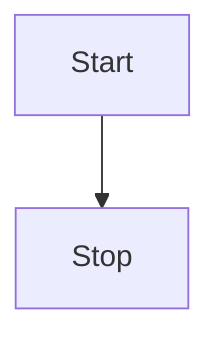

## 版本
+ Github:kubernetes/client-go
+ 分支: release-1.23

## 数据流向 todo
 


## 客户端获取数据的过程
以endpoint举例
### Lister
本地获取信息是通过Lister接口
```go
// listers/core/v1/endpoints.go
type EndpointsLister interface {
	// List 方法获取Endpoint列表
	List(selector labels.Selector) (ret []*v1.Endpoints, err error)

	// Endpoints 方法通过(namespace)缩小Lister检索数据的范围 todo
	Endpoints(namespace string) EndpointsNamespaceLister
	EndpointsListerExpansion //用于扩展
}

// endpointsLister 结构包含了一个cache,数据存在了cache里,获取数据时需要把这个cache传入函数里
type endpointsLister struct {
	indexer cache.Indexer
}

func (s *endpointsLister) List(selector labels.Selector) (ret []*v1.Endpoints, err error) {
    // cache工具包从s.indexer里遍历,找到满足selector条件的endpoint,加入到要返回的结果中
	err = cache.ListAll(s.indexer, selector, func(m interface{}) {
		ret = append(ret, m.(*v1.Endpoints))
	})
	return ret, err
}
```

### cache
cache工具包提供ListAll函数, 函数中需要传入实际存数据的载体store, 过滤器selector, 以及过滤到想要的数据时的回调函数appendFn
```go
// tools/cache/listers.go
func ListAll(store Store, selector labels.Selector, appendFn AppendFunc) error {
	selectAll := selector.Empty() // selector为空时获取所有
	for _, m := range store.List() { //调用store的List方法,遍历所有item,选取满足条件的item,通过appendFn回调放入结果集
		if selectAll {
			// selectAll 省掉后面的过滤过程,直接调用appendFn回调
			appendFn(m)
			continue
		}
		metadata, err := meta.Accessor(m) // 获取item的meta信息(比如label就包含在这里),selector中需要的label信息就在这里
		if err != nil {
			return err
		}
		if selector.Matches(labels.Set(metadata.GetLabels())) { // 对满足过滤条件的item调用appendFn回调
			appendFn(m)
		}
	}
	return nil
}
```

### Store
#### interface
Store是存数据的单元的interface,需要提供一系列接口方法增删改查里面的数据
```go
// tools/cache/store.go
type Store interface {
	Add(obj interface{}) error //增

	Update(obj interface{}) error // 改

	Delete(obj interface{}) error // 删

    // 查
	List() []interface{} 
	ListKeys() []string
	Get(obj interface{}) (item interface{}, exists bool, err error)
	GetByKey(key string) (item interface{}, exists bool, err error)

	// ...
}
```

#### 实例
cache 是实现了 Store的真正存数据的实例
```go
type cache struct {
	// 如其名,内部封装了一个线程安全的Store实例, 调用的增删改查最终调用的是这个cacheStorage的增删改查方法
	cacheStorage ThreadSafeStore
	// 生成object的key的函数,需要外部定义并传进来
	keyFunc KeyFunc
}

// NewStore新建并返回一个Store实例,调用方需要把生成key的函数当成参数传进来
func NewStore(keyFunc KeyFunc) Store {
	return &cache{
		cacheStorage: NewThreadSafeStore(Indexers{}, Indices{}),
		keyFunc:      keyFunc,
	}
}

func (c *cache) Add(obj interface{}) error {
	key, err := c.keyFunc(obj)
	if err != nil {
		return KeyError{obj, err}
	}
	c.cacheStorage.Add(key, obj)
	return nil
}

func (c *cache) Update(obj interface{}) error {
	key, err := c.keyFunc(obj)
	if err != nil {
		return KeyError{obj, err}
	}
	c.cacheStorage.Update(key, obj)
	return nil
}

func (c *cache) Delete(obj interface{}) error {
	key, err := c.keyFunc(obj)
	if err != nil {
		return KeyError{obj, err}
	}
	c.cacheStorage.Delete(key)
	return nil
}

func (c *cache) List() []interface{} {
	return c.cacheStorage.List()
}
```


## 监听数据存到本地的过程
### EndpointsInformer interface
```go
// informers/core/v1/endpoints.go
type EndpointsInformer interface {
	Informer() cache.SharedIndexInformer // 注入用于监听和更新数据的组建`Informer`
	Lister() v1.EndpointsLister
}

type endpointsInformer struct {
	factory          internalinterfaces.SharedInformerFactory
	tweakListOptions internalinterfaces.TweakListOptionsFunc
	namespace        string
}

// NewEndpointsInformer constructs a new informer for Endpoints type.
// Always prefer using an informer factory to get a shared informer instead of getting an independent
// one. This reduces memory footprint and number of connections to the server.
func NewEndpointsInformer(client kubernetes.Interface, namespace string, resyncPeriod time.Duration, indexers cache.Indexers) cache.SharedIndexInformer {
	return NewFilteredEndpointsInformer(client, namespace, resyncPeriod, indexers, nil)
}

func NewFilteredEndpointsInformer(client kubernetes.Interface, namespace string, resyncPeriod time.Duration, indexers cache.Indexers, tweakListOptions internalinterfaces.TweakListOptionsFunc) cache.SharedIndexInformer {
	return cache.NewSharedIndexInformer(
		&cache.ListWatch{
			ListFunc: func(options metav1.ListOptions) (runtime.Object, error) {
				if tweakListOptions != nil {
					tweakListOptions(&options)
				}
				return client.CoreV1().Endpoints(namespace).List(context.TODO(), options)
			},
			WatchFunc: func(options metav1.ListOptions) (watch.Interface, error) {
				if tweakListOptions != nil {
					tweakListOptions(&options)
				}
				return client.CoreV1().Endpoints(namespace).Watch(context.TODO(), options)
			},
		},
		&corev1.Endpoints{},
		resyncPeriod,
		indexers,
	)
}
```

### SharedInformer interface
SharedInformer 监听特定的资源的改变,将改动更新到本地(最终一致)
```go
// tools/cache/shared_informer.go
type SharedInformer interface {
	// AddEventHandler adds an event handler to the shared informer using the shared informer's resync
	// period.  Events to a single handler are delivered sequentially, but there is no coordination
	// between different handlers.
	AddEventHandler(handler ResourceEventHandler)
	// AddEventHandlerWithResyncPeriod adds an event handler to the
	// shared informer with the requested resync period; zero means
	// this handler does not care about resyncs.  The resync operation
	// consists of delivering to the handler an update notification
	// for every object in the informer's local cache; it does not add
	// any interactions with the authoritative storage.  Some
	// informers do no resyncs at all, not even for handlers added
	// with a non-zero resyncPeriod.  For an informer that does
	// resyncs, and for each handler that requests resyncs, that
	// informer develops a nominal resync period that is no shorter
	// than the requested period but may be longer.  The actual time
	// between any two resyncs may be longer than the nominal period
	// because the implementation takes time to do work and there may
	// be competing load and scheduling noise.
	AddEventHandlerWithResyncPeriod(handler ResourceEventHandler, resyncPeriod time.Duration)
	
    // 获取存放实际数据的Store
	GetStore() Store

	// 启动方法
	Run(stopCh <-chan struct{})
	// HasSynced returns true if the shared informer's store has been
	// informed by at least one full LIST of the authoritative state
	// of the informer's object collection.  This is unrelated to "resync".
	HasSynced() bool
	// LastSyncResourceVersion is the resource version observed when last synced with the underlying
	// store. The value returned is not synchronized with access to the underlying store and is not
	// thread-safe.
	LastSyncResourceVersion() string

	// The WatchErrorHandler is called whenever ListAndWatch drops the
	// connection with an error. After calling this handler, the informer
	// will backoff and retry.
	//
	// The default implementation looks at the error type and tries to log
	// the error message at an appropriate level.
	//
	// There's only one handler, so if you call this multiple times, last one
	// wins; calling after the informer has been started returns an error.
	//
	// The handler is intended for visibility, not to e.g. pause the consumers.
	// The handler should return quickly - any expensive processing should be
	// offloaded.
	SetWatchErrorHandler(handler WatchErrorHandler) error
}

// SharedIndexInformer 包裹SharedInformer 并增加Indexers 特性
type SharedIndexInformer interface {
	SharedInformer
	// AddIndexers add indexers to the informer before it starts.
	AddIndexers(indexers Indexers) error
	GetIndexer() Indexer
}
```

### 初始化
```go
// tools/cache/shared_informer.go
func NewSharedInformer(lw ListerWatcher, exampleObject runtime.Object, defaultEventHandlerResyncPeriod time.Duration) SharedInformer {
	return NewSharedIndexInformer(lw, exampleObject, defaultEventHandlerResyncPeriod, Indexers{})
}

func NewSharedIndexInformer(lw ListerWatcher, exampleObject runtime.Object, defaultEventHandlerResyncPeriod time.Duration, indexers Indexers) SharedIndexInformer {
	realClock := &clock.RealClock{}
    // 实际创建的是一个 `sharedIndexInformer` 结构 #ref sharedIndexInformer
	sharedIndexInformer := &sharedIndexInformer{
		processor:                       &sharedProcessor{clock: realClock},
		indexer:                         NewIndexer(DeletionHandlingMetaNamespaceKeyFunc, indexers),
		listerWatcher:                   lw,
		objectType:                      exampleObject,
		resyncCheckPeriod:               defaultEventHandlerResyncPeriod,
		defaultEventHandlerResyncPeriod: defaultEventHandlerResyncPeriod,
		cacheMutationDetector:           NewCacheMutationDetector(fmt.Sprintf("%T", exampleObject)),
		clock:                           realClock,
	}
	return sharedIndexInformer
}

type sharedIndexInformer struct {
	indexer    Indexer
	controller Controller

	processor             *sharedProcessor
	cacheMutationDetector MutationDetector

	listerWatcher ListerWatcher // 用于和监听集群资源变动事件的核心组件,不同资源的informer对应了不同的listerWatcher参数设置

	// objectType is an example object of the type this informer is
	// expected to handle.  Only the type needs to be right, except
	// that when that is `unstructured.Unstructured` the object's
	// `"apiVersion"` and `"kind"` must also be right.
	objectType runtime.Object

	// resyncCheckPeriod is how often we want the reflector's resync timer to fire so it can call
	// shouldResync to check if any of our listeners need a resync.
	resyncCheckPeriod time.Duration
	// defaultEventHandlerResyncPeriod is the default resync period for any handlers added via
	// AddEventHandler (i.e. they don't specify one and just want to use the shared informer's default
	// value).
	defaultEventHandlerResyncPeriod time.Duration
	// clock allows for testability
	clock clock.Clock

	started, stopped bool
	startedLock      sync.Mutex

	// blockDeltas gives a way to stop all event distribution so that a late event handler
	// can safely join the shared informer.
	blockDeltas sync.Mutex

	// Called whenever the ListAndWatch drops the connection with an error.
	watchErrorHandler WatchErrorHandler
}


```