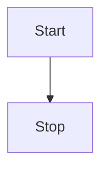

## 版本
+ Github:kubernetes/client-go
+ 分支: release-1.23

## 数据流向 todo
 informer 相当于把响应客户端获取数据请求(Lister) 与 从集群拿数据(Informer)两部分分离


## 客户端获取数据的过程
以endpoint举例
### Lister
本地获取信息是通过Lister接口
```go
// listers/core/v1/endpoints.go
type EndpointsLister interface {
	// List 方法获取Endpoint列表
	List(selector labels.Selector) (ret []*v1.Endpoints, err error)

	// Endpoints 方法通过(namespace)缩小Lister检索数据的范围 todo
	Endpoints(namespace string) EndpointsNamespaceLister
	EndpointsListerExpansion //用于扩展
}

// endpointsLister 结构包含了一个cache,数据存在了cache里,获取数据时需要把这个cache传入函数里
type endpointsLister struct {
	indexer cache.Indexer
}

func (s *endpointsLister) List(selector labels.Selector) (ret []*v1.Endpoints, err error) {
    // cache工具包从s.indexer里遍历,找到满足selector条件的endpoint,加入到要返回的结果中
	err = cache.ListAll(s.indexer, selector, func(m interface{}) {
		ret = append(ret, m.(*v1.Endpoints))
	})
	return ret, err
}
```

### cache
cache工具包提供ListAll函数, 函数中需要传入实际存数据的载体store, 过滤器selector, 以及过滤到想要的数据时的回调函数appendFn
```go
// tools/cache/listers.go
func ListAll(store Store, selector labels.Selector, appendFn AppendFunc) error {
	selectAll := selector.Empty() // selector为空时获取所有
	for _, m := range store.List() { //调用store的List方法,遍历所有item,选取满足条件的item,通过appendFn回调放入结果集
		if selectAll {
			// selectAll 省掉后面的过滤过程,直接调用appendFn回调
			appendFn(m)
			continue
		}
		metadata, err := meta.Accessor(m) // 获取item的meta信息(比如label就包含在这里),selector中需要的label信息就在这里
		if err != nil {
			return err
		}
		if selector.Matches(labels.Set(metadata.GetLabels())) { // 对满足过滤条件的item调用appendFn回调
			appendFn(m)
		}
	}
	return nil
}
```

### Store
#### interface
Store是存数据的单元的interface,需要提供一系列接口方法增删改查里面的数据
```go
// tools/cache/store.go
type Store interface {
	Add(obj interface{}) error //增

	Update(obj interface{}) error // 改

	Delete(obj interface{}) error // 删

    // 查
	List() []interface{} 
	ListKeys() []string
	Get(obj interface{}) (item interface{}, exists bool, err error)
	GetByKey(key string) (item interface{}, exists bool, err error)

	// ...
}
```

#### 实例
cache 是实现了 Store的真正存数据的实例
```go
type cache struct {
	// 如其名,内部封装了一个线程安全的Store实例, 调用的增删改查最终调用的是这个cacheStorage的增删改查方法
	cacheStorage ThreadSafeStore
	// 生成object的key的函数,需要外部定义并传进来
	keyFunc KeyFunc
}

// NewStore新建并返回一个Store实例,调用方需要把生成key的函数当成参数传进来
func NewStore(keyFunc KeyFunc) Store {
	return &cache{
		cacheStorage: NewThreadSafeStore(Indexers{}, Indices{}),
		keyFunc:      keyFunc,
	}
}

func (c *cache) Add(obj interface{}) error {
	key, err := c.keyFunc(obj)
	if err != nil {
		return KeyError{obj, err}
	}
	c.cacheStorage.Add(key, obj)
	return nil
}

func (c *cache) Update(obj interface{}) error {
	key, err := c.keyFunc(obj)
	if err != nil {
		return KeyError{obj, err}
	}
	c.cacheStorage.Update(key, obj)
	return nil
}

func (c *cache) Delete(obj interface{}) error {
	key, err := c.keyFunc(obj)
	if err != nil {
		return KeyError{obj, err}
	}
	c.cacheStorage.Delete(key)
	return nil
}

func (c *cache) List() []interface{} {
	return c.cacheStorage.List()
}
```


## 监听数据存到本地的过程(Informer)
informer 通过kubernetes原生提供的 list 和 watch 接口来实现对资源的 ‘全量’--‘增量’--‘增量’...... 的监听和处理
### struct 
```go
// tools/cache/shared_informer.go
type sharedIndexInformer struct {
	indexer    Indexer  // 实际存储资源的结构,包裹了Store
	controller Controller   // todo

	processor             *sharedProcessor //todo
	cacheMutationDetector MutationDetector // 已经缓存到本地的资源检测是否发生变动的Detector todo

	listerWatcher ListerWatcher // 对应资源的list 和 watch接口
	objectType runtime.Object // 监听的资源的结构,ListAndWatch接口得到的数据需要解析到这样的结构里

	defaultEventHandlerResyncPeriod time.Duration // todo

	// Called whenever the ListAndWatch drops the connection with an error.
	watchErrorHandler WatchErrorHandler // todo
}
```
### 实现EndpointsInformer 
```go
// informers/core/v1/endpoints.go
func NewEndpointsInformer(client kubernetes.Interface, namespace string, resyncPeriod time.Duration, indexers cache.Indexers) cache.SharedIndexInformer {
	return NewFilteredEndpointsInformer(client, namespace, resyncPeriod, indexers, nil)
}

func NewFilteredEndpointsInformer(client kubernetes.Interface, namespace string, resyncPeriod time.Duration, indexers cache.Indexers, tweakListOptions internalinterfaces.TweakListOptionsFunc) cache.SharedIndexInformer {
	return cache.NewSharedIndexInformer(
		&cache.ListWatch{ // 为endpoints实现的一套listWatch
			ListFunc: func(options metav1.ListOptions) (runtime.Object, error) {
				if tweakListOptions != nil {
					tweakListOptions(&options)
				}
				return client.CoreV1().Endpoints(namespace).List(context.TODO(), options)
			},
			WatchFunc: func(options metav1.ListOptions) (watch.Interface, error) {
				if tweakListOptions != nil {
					tweakListOptions(&options)
				}
				return client.CoreV1().Endpoints(namespace).Watch(context.TODO(), options)
			},
		},

		&corev1.Endpoints{}, // 监听的资源的结构
		resyncPeriod, // ??似乎已无用
		indexers, // 包裹了实际存储数据的Store
	)
}

// tools/cache/shared_informer.go
// 所有informer底层共用一套结构,通过传入(注入)的参数和实例来实现不同资源的informer
func NewSharedIndexInformer(lw ListerWatcher, exampleObject runtime.Object, defaultEventHandlerResyncPeriod time.Duration, indexers Indexers) SharedIndexInformer {
	realClock := &clock.RealClock{}
	sharedIndexInformer := &sharedIndexInformer{
		processor:                       &sharedProcessor{clock: realClock},
		indexer:                         NewIndexer(DeletionHandlingMetaNamespaceKeyFunc, indexers),
		listerWatcher:                   lw,    // 传入的list/watch 实现
		objectType:                      exampleObject, // 传入的监听资源的结构
		resyncCheckPeriod:               defaultEventHandlerResyncPeriod,   // ??似乎已无用
		defaultEventHandlerResyncPeriod: defaultEventHandlerResyncPeriod,   // eventHandler 间隔时间 ?? todo 
		cacheMutationDetector:           NewCacheMutationDetector(fmt.Sprintf("%T", exampleObject)),
		clock:                           realClock,
	}
	return sharedIndexInformer
}
```

### 启动endpointsInformer
```go
// tools/cache/shared_informer.go
func (s *sharedIndexInformer) Run(stopCh <-chan struct{}) {
	// ...
    // s.indexer包裹了本地数据存储结构, 这里再把这个结构包裹一层,用于拦截并数据变动事件
	fifo := NewDeltaFIFOWithOptions(DeltaFIFOOptions{
		KnownObjects:          s.indexer,
		EmitDeltaTypeReplaced: true,
	})

	cfg := &Config{
		Queue:            fifo, // 数据本地存储结构现在包裹在这个Queue的深处了
		ListerWatcher:    s.listerWatcher,  // ListAndWatch的实现接口
		ObjectType:       s.objectType, // 监听资源的结构,用于将ListAndWatch获取的数据解析到这个机构里
		FullResyncPeriod: s.resyncCheckPeriod,
		RetryOnError:     false,
		ShouldResync:     s.processor.shouldResync,

		Process:           s.HandleDeltas,
		WatchErrorHandler: s.watchErrorHandler,
	}

	func() {     // 为内部初始化一个controller,将Config注入到这个controller,后面用来处理list/watch 的执行数据更新
		s.startedLock.Lock()
		defer s.startedLock.Unlock()

		s.controller = New(cfg)
		s.controller.(*controller).clock = s.clock
		s.started = true
	}()
    // ...
	processorStopCh := make(chan struct{})
	// ...
	wg.StartWithChannel(processorStopCh, s.cacheMutationDetector.Run) // todo 
	wg.StartWithChannel(processorStopCh, s.processor.run) // 处理资源发生变动触发自定义回调的processor

    // ...
    // 启动 执行ListAndWatch的controller
	s.controller.Run(stopCh)
}
```
#### Controller
Controller 把信息通过ListAndWatch从kubernetes api 取下来,然后 Push到本地一个队列里
```go
// tools/cache/controller.go

func (c *controller) Run(stopCh <-chan struct{}) {
	defer utilruntime.HandleCrash()
	go func() {
		<-stopCh // 收到stopCh 信号时调用事件队列的Close方法收尾
		c.config.Queue.Close()
	}()
    // 新建一个reflector结构,将那些监听不同资源的差异化参数传入该结构 
	r := NewReflector(
		c.config.ListerWatcher,
		c.config.ObjectType,
		c.config.Queue,
		c.config.FullResyncPeriod,
	)
	// ...
    // 启动reflector #ref r.Run
	wg.StartWithChannel(stopCh, r.Run)

	wait.Until(c.processLoop, time.Second, stopCh) // todo
	wg.Wait()
}
```
#### Reflector Run
Reflector Run 方法周期性的执行List And Watch
```go
// tools/cache/reflector.go
func (r *Reflector) Run(stopCh <-chan struct{}) {
    // wait.BackoffUntil 传入的第二个参数 r.backoffManager每隔一段时间(既定的)会产生一个信号,收到这个信号就会调用一次第一个参数传入的函数,即listAndWatch流程
    // r.backoffManager 是在前面 NewReflector 时生成的 
	wait.BackoffUntil(func() { 
        // 调用listAndWatch 进入informer的核心流程
		if err := r.ListAndWatch(stopCh); err != nil {
			r.watchErrorHandler(r, err)
		}
	}, r.backoffManager, true, stopCh) 
}

// informer的核心流程 listAndWatch
func (r *Reflector) ListAndWatch(stopCh <-chan struct{}) error {
	var resourceVersion string

	options := metav1.ListOptions{ResourceVersion: r.relistResourceVersion()}

    // list
	if err := func() error {
		// ...
		var list runtime.Object
		var paginatedResult bool
		var err error
		listCh := make(chan struct{}, 1)
		panicCh := make(chan interface{}, 1)
		go func() {
			
			// list接口也可能需要调用几次分页获取,再封装一层pager 将原listerWatcher包裹进去
			pager := pager.New(pager.SimplePageFunc(func(opts metav1.ListOptions) (runtime.Object, error) {
				return r.listerWatcher.List(opts)
			}))
			// ...
            // 调用pager.list获取所有数据结果存放在 ‘list’变量里
			list, paginatedResult, err = pager.List(context.Background(), options)
			// ...
		}()
		// ...

	}(); err != nil {
		return err
	}

    // ...

	for {// 循环从Watch接口中获取资源更新
        // ...
		w, err := r.listerWatcher.Watch(options) // 启动Watch接口
		//...
        // 当Watch接口返回东西时调用Handler更新本地数据 #ref r.watchHandler
		if err := r.watchHandler(start, w, &resourceVersion, resyncerrc, stopCh); err != nil {
			// ...
		}
	}
}

func (r *Reflector) watchHandler(start time.Time, w watch.Interface, resourceVersion *string, errc chan error, stopCh <-chan struct{}) error {

loop:
	for {
		select {
		// ...
		case event, ok := <-w.ResultChan():
			// ...
			switch event.Type { // 根据watch事件的不同调用store的不同方法,更新本地数据
			case watch.Added:
				err := r.store.Add(event.Object)
			case watch.Modified:
				err := r.store.Update(event.Object)
			case watch.Deleted:
				err := r.store.Delete(event.Object)
			case watch.Bookmark:
				// A `Bookmark` means watch has synced here, just update the resourceVersion
			default:
				utilruntime.HandleError(fmt.Errorf("%s: unable to understand watch event %#v", r.name, event))
			}
			// ...
		}
	}
    // ...
}

```
#### store 的 Add, Update, Delete方法
store的实体是前面创建的DeltaFifo实体,将通过ListAndWatch取回的数据变动归类整理然后排队push到一个Queue里
```go
// tools/cache/delta_fifo.go
// 都是调用`f.queueActionLocked`
func (f *DeltaFIFO) Add(obj interface{}) error {
	// ...
	return f.queueActionLocked(Added, obj)
}

func (f *DeltaFIFO) Update(obj interface{}) error {
	// ...
	return f.queueActionLocked(Updated, obj)
}

func (f *DeltaFIFO) Delete(obj interface{}) error {
	// ...
	return f.queueActionLocked(Deleted, obj)
}

func (f *DeltaFIFO) queueActionLocked(actionType DeltaType, obj interface{}) error {
	// 每隔object都有一个key,在这里把不同object的改动分流到不同的队列里(便于合并操作)
	id, err := f.KeyOf(obj)
	// ...
	oldDeltas := f.items[id]
	newDeltas := append(oldDeltas, Delta{actionType, obj})
	newDeltas = dedupDeltas(newDeltas)

	if len(newDeltas) > 0 {
		// 然后将整个代表一个object的改动作为一个整体append到queue队列里
		if _, exists := f.items[id]; !exists {
			f.queue = append(f.queue, id) // todo queue在哪里用到
		}
		f.items[id] = newDeltas
		f.cond.Broadcast() // 调用cond.Broadcast方法,使所有等待这个cond同志的goroutine开始行动,用于queue队列为空时减少空循环
	} 
	// ...
	return nil
}
```

#### Reflector ProcessLoop
无限循环从Queue里pop出object变动事件并处理
```go
// tools/cache/controller.go
func (c *controller) processLoop() {
	for {
		obj, err := c.config.Queue.Pop(PopProcessFunc(c.config.Process))
		// ...
	}
}
```
```go
// tools/cache/delta_fifo.go
func (f *DeltaFIFO) Pop(process PopProcessFunc) (interface{}, error) {
	for {
		for len(f.queue) == 0 {
			// 防止队列为空时不停的询问
			f.cond.Wait()
		}
		// 如其名,这是个FIFO队列,把对头取出
		id := f.queue[0]
		f.queue = f.queue[1:]
		depth := len(f.queue)
		if f.initialPopulationCount > 0 {
			f.initialPopulationCount--
		}
		// 取出objectId代表的所有变动
		item, ok := f.items[id]

		delete(f.items, id)
		// ...
		// 这个process是方法传入的参数,对所有当前objectId的变动进行处理(这里一层层倒推,得到传进来的是sharedIndexInformer的HandleDelta方法) #ref (s *sharedIndexInformer) HandleDeltas(obj interface{}) 
		err := process(item)
		// ...
		return item, err
	}
}
```
```go
// tools/cache/shared_informer.go
func (s *sharedIndexInformer) HandleDeltas(obj interface{}) error {
	// ...
	// 依次执行当前object的变动
	for _, d := range obj.(Deltas) {
		switch d.Type {
		case Sync, Replaced, Added, Updated:
			s.cacheMutationDetector.AddObject(d.Object)
			if old, exists, err := s.indexer.Get(d.Object); err == nil && exists {
				if err := s.indexer.Update(d.Object); err != nil { // 变更本地内容
					return err
				}
				// ...
				// 将更新事件分发给所有监听的listener
				s.processor.distribute(updateNotification{oldObj: old, newObj: d.Object}, isSync)
			} else {
				// ...
				// 新增事件分发
				s.processor.distribute(addNotification{newObj: d.Object}, false)
			}
		case Deleted:
			// 删除事件分发
			s.processor.distribute(deleteNotification{oldObj: d.Object}, false)
		}
	}
	return nil
}

// 为每一个listener生成一个事件信号
func (p *sharedProcessor) distribute(obj interface{}, sync bool) {
	// ...
	// 给每一个监听该事件的listener发送一个事件信号(自定帝的add,update,delete回调函数就是取这里得到的信号); todo sync事件具体指啥
	if sync {
		for _, listener := range p.syncingListeners {
			listener.add(obj)
		}
	} else {
		for _, listener := range p.listeners {
			listener.add(obj)
		}
	}
}
// 给listener一个addCh信号
func (p *processorListener) add(notification interface{}) {
	p.addCh <- notification
}
```


### EventHandler
#### 新增EventHandler
`informer`可以通过 `AddEventHandler`方法注册一系列如Add,Update,Delete事件的回调函数
```go
// tools/cache/shared_informer.go
func (s *sharedIndexInformer) AddEventHandler(handler ResourceEventHandler) {
	s.AddEventHandlerWithResyncPeriod(handler, s.defaultEventHandlerResyncPeriod)
}
func (s *sharedIndexInformer) AddEventHandlerWithResyncPeriod(handler ResourceEventHandler, resyncPeriod time.Duration) {
	// ...
    // 使用已有的handler 和 resyncPeriod 参数创建一个listener
	listener := newProcessListener(handler, resyncPeriod, determineResyncPeriod(resyncPeriod, s.resyncCheckPeriod), s.clock.Now(), initialBufferSize)
    // ...
    // 调用 addListener 将listener加入processor中
	s.processor.addListener(listener)
    // ...
}


func (p *sharedProcessor) addListener(listener *processorListener) {
	// ...
	p.addListenerLocked(listener)
    // ...
}

func (p *sharedProcessor) addListenerLocked(listener *processorListener) {
	p.listeners = append(p.listeners, listener) // todo
	p.syncingListeners = append(p.syncingListeners, listener) // todo
}
```
#### EventHandler的触发时机
sharedIndexInformer 的 Run 方法执行时会调用 processor的执行
```go
// tools/cache/shared_informer.go
func (s *sharedIndexInformer) Run(stopCh <-chan struct{}) {
	// ...
	wg.StartWithChannel(processorStopCh, s.processor.run) // 处理资源发生变动触发自定义回调的processor

    // ...
}

func (p *sharedProcessor) run(stopCh <-chan struct{}) {
	func() {
		// ...
		for _, listener := range p.listeners { // 遍历已注册的listener,执行listener的run 和 pop 方法启动
			p.wg.Start(listener.run) // run 负责把存在本地的事件执行
			p.wg.Start(listener.pop) // todo pop 负责把事件存在本地??
		}
		p.listenersStarted = true
	}()
	// ... 
}

func (p *processorListener) run() {
	stopCh := make(chan struct{})
    // 每隔 1 * time.Second 取出nextCh里的所有事件,触发相应的注册的Handler(add,update,delete)
	wait.Until(func() {
		for next := range p.nextCh {
			switch notification := next.(type) {
			case updateNotification:
				p.handler.OnUpdate(notification.oldObj, notification.newObj)
			case addNotification:
				p.handler.OnAdd(notification.newObj)
			case deleteNotification:
				p.handler.OnDelete(notification.oldObj)
			default:
				utilruntime.HandleError(fmt.Errorf("unrecognized notification: %T", next))
			}
		}
		// the only way to get here is if the p.nextCh is empty and closed
		close(stopCh)
	}, 1*time.Second, stopCh)
}
```

#### processorListener 的 nextCh的事件来源
```go

```