# 版本
release-1.27 

# 序
kubeproxy在每个node上都有运行一个, kubeproxy用于跟进kubernetes控制面的 service  和 endpoint信息,更新本地iptable,使得进出当前node的流量能转发到正确的目的地;
> 例如: 当前node一个pod发送一个请求到一个服务的cluster ip, kubeproxy需要制定规则把这个cluster ip 转发到具体的pod ip上;

# 源码
## Run
```go
// cmd/kube-proxy/app/server.go
func (s *ProxyServer) Run() error {
	// ...
	labelSelector := labels.NewSelector()
	labelSelector = labelSelector.Add(*noProxyName, *noHeadlessEndpoints)

	// Make informers that filter out objects that want a non-default service proxy.
	informerFactory := informers.NewSharedInformerFactoryWithOptions(s.Client, s.ConfigSyncPeriod,
		informers.WithTweakListOptions(func(options *metav1.ListOptions) {
			options.LabelSelector = labelSelector.String()
		}))

	// 注册监听k8s里的service资源
	serviceConfig := config.NewServiceConfig(informerFactory.Core().V1().Services(), s.ConfigSyncPeriod)
	serviceConfig.RegisterEventHandler(s.Proxier)
	go serviceConfig.Run(wait.NeverStop)

    // 注册监听k8s里的endpointslice资源
	endpointSliceConfig := config.NewEndpointSliceConfig(informerFactory.Discovery().V1().EndpointSlices(), s.ConfigSyncPeriod)
	endpointSliceConfig.RegisterEventHandler(s.Proxier)
	go endpointSliceConfig.Run(wait.NeverStop)

	// This has to start after the calls to NewServiceConfig because that
	// function must configure its shared informer event handlers first.
	informerFactory.Start(wait.NeverStop)

	// Make an informer that selects for our nodename.
	currentNodeInformerFactory := informers.NewSharedInformerFactoryWithOptions(s.Client, s.ConfigSyncPeriod,
		informers.WithTweakListOptions(func(options *metav1.ListOptions) {
			options.FieldSelector = fields.OneTermEqualSelector("metadata.name", s.NodeRef.Name).String()
		}))
	nodeConfig := config.NewNodeConfig(currentNodeInformerFactory.Core().V1().Nodes(), s.ConfigSyncPeriod)
	// https://issues.k8s.io/111321
	if s.localDetectorMode == kubeproxyconfig.LocalModeNodeCIDR {
		nodeConfig.RegisterEventHandler(proxy.NewNodePodCIDRHandler(s.podCIDRs))
	}
	nodeConfig.RegisterEventHandler(s.Proxier)

	go nodeConfig.Run(wait.NeverStop)

	// This has to start after the calls to NewNodeConfig because that must
	// configure the shared informer event handler first.
	currentNodeInformerFactory.Start(wait.NeverStop)

	// Birth Cry after the birth is successful
	s.birthCry()

	go s.Proxier.SyncLoop()

	return <-errCh
}
```

### Service事件方法的注册与回调
#### 注册
```go
// pkg/proxy/config/config.go
func (c *ServiceConfig) RegisterEventHandler(handler ServiceHandler) {
	c.eventHandlers = append(c.eventHandlers, handler)
}
```
#### 回调
当有service资源的变动事件发生时会回调下面的方法 add,update,delete
```go
// pkg/proxy/config/config.go
func (c *ServiceConfig) handleAddService(obj interface{}) {
	service, ok := obj.(*v1.Service)
	if !ok {
		utilruntime.HandleError(fmt.Errorf("unexpected object type: %v", obj))
		return
	}
	for i := range c.eventHandlers {
		klog.V(4).InfoS("Calling handler.OnServiceAdd")
		c.eventHandlers[i].OnServiceAdd(service)
	}
}

func (c *ServiceConfig) handleUpdateService(oldObj, newObj interface{}) {
	oldService, ok := oldObj.(*v1.Service)
	if !ok {
		utilruntime.HandleError(fmt.Errorf("unexpected object type: %v", oldObj))
		return
	}
	service, ok := newObj.(*v1.Service)
	if !ok {
		utilruntime.HandleError(fmt.Errorf("unexpected object type: %v", newObj))
		return
	}
	for i := range c.eventHandlers {
		klog.V(4).InfoS("Calling handler.OnServiceUpdate")
		c.eventHandlers[i].OnServiceUpdate(oldService, service)
	}
}

func (c *ServiceConfig) handleDeleteService(obj interface{}) {
	service, ok := obj.(*v1.Service)
	if !ok {
		tombstone, ok := obj.(cache.DeletedFinalStateUnknown)
		if !ok {
			utilruntime.HandleError(fmt.Errorf("unexpected object type: %v", obj))
			return
		}
		if service, ok = tombstone.Obj.(*v1.Service); !ok {
			utilruntime.HandleError(fmt.Errorf("unexpected object type: %v", obj))
			return
		}
	}
	for i := range c.eventHandlers {
		klog.V(4).InfoS("Calling handler.OnServiceDelete")
		c.eventHandlers[i].OnServiceDelete(service)
	}
}
```
#### 实际proxy实现的回调方法
add,update,delete最终都调用`proxier.serviceChanges.Update`方法
```go
func (proxier *Proxier) OnServiceAdd(service *v1.Service) {
	proxier.OnServiceUpdate(nil, service)
}

func (proxier *Proxier) OnServiceUpdate(oldService, service *v1.Service) {
    // proxier.serviceChanges.Update 在本地生成一条服务改变记录(但实际并未改变啥) #ref proxier.serviceChanges.Update
    // proxier.isInitialized() 判断proxy是否已经就绪 todo proxier.isInitialized()
	if proxier.serviceChanges.Update(oldService, service) && proxier.isInitialized() {
        // 只有在有变动生成且proxyier已经就绪时才会把服务下发到系统内核
		proxier.Sync()
	}
}

func (proxier *Proxier) OnServiceDelete(service *v1.Service) {
	proxier.OnServiceUpdate(service, nil)
}

```
##### proxier.serviceChanges.Update
```go
// pkg/proxy/service.go
func (sct *ServiceChangeTracker) Update(previous, current *v1.Service) bool {
	// ...

    // 删除操作时仍然需要以前服务的一些信息(名字,命名空间)
	svc := current
	if svc == nil {
		svc = previous
	}
	metrics.ServiceChangesTotal.Inc()
    // 获取变更后的服务名
	namespacedName := types.NamespacedName{Namespace: svc.Namespace, Name: svc.Name}

	sct.lock.Lock()
	defer sct.lock.Unlock()

    // 判断是否有同一个服务还没有完成的‘serviceChange’
	change, exists := sct.items[namespacedName]
	if !exists { // 没有则新建一个‘serviceChange’
		change = &serviceChange{}
        // 将原来的服务的内容格式化
		change.previous = sct.serviceToServiceMap(previous)
		sct.items[namespacedName] = change
	}
    // 将新服务的内容格式化
	change.current = sct.serviceToServiceMap(current)
	// 没有变化则直接删除掉此次变更
	if reflect.DeepEqual(change.previous, change.current) {
		delete(sct.items, namespacedName)
	} else {
		klog.V(4).InfoS("Service updated ports", "service", klog.KObj(svc), "portCount", len(change.current))
	}
	metrics.ServiceChangesPending.Set(float64(len(sct.items)))
	return len(sct.items) > 0
}

```
##### SyncLoop
```go
// pkg/proxy/iptables/proxier.go
func (proxier *Proxier) SyncLoop() {
	// ...
	proxier.syncRunner.Loop(wait.NeverStop)
}

```
```go
// pkg/util/async/bounded_frequency_runner.go
func (bfr *BoundedFrequencyRunner) Loop(stop <-chan struct{}) {
	klog.V(3).Infof("%s Loop running", bfr.name)
	bfr.timer.Reset(bfr.maxInterval)
	for {
		select {
		case <-stop:
			bfr.stop()
			klog.V(3).Infof("%s Loop stopping", bfr.name)
			return
		case <-bfr.timer.C():
			bfr.tryRun()
		case <-bfr.run:
			bfr.tryRun()
		case <-bfr.retry:
			bfr.doRetry()
		}
	}
}
func (bfr *BoundedFrequencyRunner) tryRun() {
	bfr.mu.Lock()
	defer bfr.mu.Unlock()

	if bfr.limiter.TryAccept() {
		// 执行回调,比如iptables 就是在这里把服务规则解析并根据解析结果设置转发规则给内核
        // 在iptable中就是 
		bfr.fn()
		bfr.lastRun = bfr.timer.Now()
		bfr.timer.Stop()
		bfr.timer.Reset(bfr.maxInterval)
		klog.V(3).Infof("%s: ran, next possible in %v, periodic in %v", bfr.name, bfr.minInterval, bfr.maxInterval)
		return
	}

	// It can't run right now, figure out when it can run next.
	elapsed := bfr.timer.Since(bfr.lastRun)   // how long since last run
	nextPossible := bfr.minInterval - elapsed // time to next possible run
	nextScheduled := bfr.timer.Remaining()    // time to next scheduled run
	klog.V(4).Infof("%s: %v since last run, possible in %v, scheduled in %v", bfr.name, elapsed, nextPossible, nextScheduled)

	// It's hard to avoid race conditions in the unit tests unless we always reset
	// the timer here, even when it's unchanged
	if nextPossible < nextScheduled {
		nextScheduled = nextPossible
	}
	bfr.timer.Stop()
	bfr.timer.Reset(nextScheduled)
}
```

### Iptable
#### iptables原理图

无论是外部流量进入还是内部流量出去 都需要走同一套流程
k8s使用了iptables的filter表和nat表。filter表用于处理入站和出站的数据包，而nat表用于网络地址转换。
#### 同步规则到iptables的代码逻辑
```go
// pkg/proxy/iptables/proxier.go
func (proxier *Proxier) syncProxyRules() {
	proxier.mu.Lock()
	defer proxier.mu.Unlock()
	// ...
	success := false
	if !tryPartialSync {
        // 创建基本的chain 和跳转关系, iptablesJumpChains 和 iptablesKubeletJumpChains 见chain 跳转图
		for _, jump := range append(iptablesJumpChains, iptablesKubeletJumpChains...) {
			if _, err := proxier.iptables.EnsureChain(jump.table, jump.dstChain); err != nil {
				klog.ErrorS(err, "Failed to ensure chain exists", "table", jump.table, "chain", jump.dstChain)
				return
			}
			args := jump.extraArgs
			if jump.comment != "" {
				args = append(args, "-m", "comment", "--comment", jump.comment)
			}
			args = append(args, "-j", string(jump.dstChain))
			if _, err := proxier.iptables.EnsureRule(utiliptables.Prepend, jump.table, jump.srcChain, args...); err != nil {
				klog.ErrorS(err, "Failed to ensure chain jumps", "table", jump.table, "srcChain", jump.srcChain, "dstChain", jump.dstChain)
				return
			}
		}
	}

	// 清理chain和规则的本地缓存,只用户层的缓存
	proxier.filterChains.Reset()
	proxier.filterRules.Reset()
	proxier.natChains.Reset()
	proxier.natRules.Reset()

	// 准备所有自定义chain的信息(后面直接使用来拼接iptable 语句)
	for _, chainName := range []utiliptables.Chain{kubeServicesChain, kubeExternalServicesChain, kubeForwardChain, kubeNodePortsChain, kubeProxyFirewallChain} {
        // filter 表
		proxier.filterChains.Write(utiliptables.MakeChainLine(chainName))
	}
	for _, chainName := range []utiliptables.Chain{kubeServicesChain, kubeNodePortsChain, kubePostroutingChain, kubeMarkMasqChain} {
        // nat 表
		proxier.natChains.Write(utiliptables.MakeChainLine(chainName))
	}

	// kubePostroutingChain 中设定不满足 masqueradeMark 标记时直接跳过该链(kubePostroutingChain)
    // 这个标记用来表示发出去的包需要隐藏源ip替换成出口ip
    // todo 这个标记在哪里打的
	proxier.natRules.Write(
		"-A", string(kubePostroutingChain),
		"-m", "mark", "!", "--mark", fmt.Sprintf("%s/%s", proxier.masqueradeMark, proxier.masqueradeMark),
		"-j", "RETURN",
	)
	// 到这里说明没有返回,需要在kubePostroutingChain里继续执行规则,先清除已有的 masqueradeMark 标记
	proxier.natRules.Write(
		"-A", string(kubePostroutingChain),
		"-j", "MARK", "--xor-mark", proxier.masqueradeMark,
	)

    // -j MASQUERADE 作用将源ip替换成出口ip
	masqRule := []string{
		"-A", string(kubePostroutingChain),
		"-m", "comment", "--comment", `"kubernetes service traffic requiring SNAT"`,
		"-j", "MASQUERADE",
	}
	proxier.natRules.Write(masqRule)

	// todo 这个chain 在流程的哪里??
	proxier.natRules.Write(
		"-A", string(kubeMarkMasqChain),
		"-j", "MARK", "--or-mark", proxier.masqueradeMark,
	)


	// 不是每一个chain最终都有实际内容,没有实际内容的在这里就不会置位true
	activeNATChains := map[utiliptables.Chain]bool{} // use a map as a set

	args := make([]string, 64)

	// Compute total number of endpoint chains across all services
	// to get a sense of how big the cluster is.
	totalEndpoints := 0
	for svcName := range proxier.svcPortMap {
		totalEndpoints += len(proxier.endpointsMap[svcName])
	}
	proxier.largeClusterMode = (totalEndpoints > largeClusterEndpointsThreshold)

	// 遍历已知的服务列表
	for svcName, svc := range proxier.svcPortMap {
		svcInfo, ok := svc.(*servicePortInfo)
		// ...
		protocol := strings.ToLower(string(svcInfo.Protocol()))
		svcPortNameString := svcInfo.nameString

		// 通过服务名找到该服务对应的endpointslice
		allEndpoints := proxier.endpointsMap[svcName]
        // 给所有endpoint分类
		// clusterEndpoint 是集群endpoint
		// localEndpoint 是本地(共享一个kube-proxy)的endpoint
		clusterEndpoints, localEndpoints, allLocallyReachableEndpoints, hasEndpoints := proxy.CategorizeEndpoints(allEndpoints, svcInfo, proxier.nodeLabels)

		// 每个endpoint 都是一个独立的chain,在 activeNATChains 表中设置为 true
		for _, ep := range allLocallyReachableEndpoints {
			if epInfo, ok := ep.(*endpointsInfo); ok {
				activeNATChains[epInfo.ChainName] = true
			}
		}

		// 给集群访问服务创建一条 clusterPolicyChain
		clusterPolicyChain := svcInfo.clusterPolicyChainName
		usesClusterPolicyChain := len(clusterEndpoints) > 0 && svcInfo.UsesClusterEndpoints()
		if usesClusterPolicyChain {
			activeNATChains[clusterPolicyChain] = true
		}

		// 给当前node访问服务创建一条 localPolicyChain
		localPolicyChain := svcInfo.localPolicyChainName
		usesLocalPolicyChain := len(localEndpoints) > 0 && svcInfo.UsesLocalEndpoints()
		if usesLocalPolicyChain {
			activeNATChains[localPolicyChain] = true
		}

		// 创建集群内访问(ClusterIP)的 internalPolicyChain
		internalPolicyChain := clusterPolicyChain
		hasInternalEndpoints := hasEndpoints
		if svcInfo.InternalPolicyLocal() {
			// 当开启了InternalPolicyLocal时, internalPolicyChain 指向 localPolicyChain
			internalPolicyChain = localPolicyChain
			if len(localEndpoints) == 0 {
				hasInternalEndpoints = false
			}
		}
		internalTrafficChain := internalPolicyChain

		// 创建通过集群外部方式访问((NodePort, LoadBalancer, and ExternalIP)的 externalPolicyChain
		// 注: 这个内部,外部访问并不是指访问服务的源调用方,仅仅是请求服务的方式
		// 同样如果开启了ExternalPolicyLocal时, externalPolicyChain 指向 localPolicyChain
		externalPolicyChain := clusterPolicyChain
		hasExternalEndpoints := hasEndpoints
		if svcInfo.ExternalPolicyLocal() {
			externalPolicyChain = localPolicyChain
			if len(localEndpoints) == 0 {
				hasExternalEndpoints = false
			}
		}
		externalTrafficChain := svcInfo.externalChainName // eventually jumps to externalPolicyChain


		var internalTrafficFilterTarget, internalTrafficFilterComment string
		var externalTrafficFilterTarget, externalTrafficFilterComment string
		if !hasEndpoints {
			// 一个服务没有endpoint 直接将目标置换为 REJECT(无论是internal 还是 external)
			internalTrafficFilterTarget = "REJECT"
			// ...
			externalTrafficFilterTarget = "REJECT"
			// ...
		} else { // 服务存在endpoint 的情况
			if !hasInternalEndpoints {
				// 服务在本机群上没有endpoint,将internalTarget 设置为drop
				internalTrafficFilterTarget = "DROP"
				// ...
			}
			if !hasExternalEndpoints {
				// 当服务没有外部endpoint时,将externalTarget 设置为drop
				externalTrafficFilterTarget = "DROP"
				// ...
			}
		}

		// 找到cluster endpoint时,在 kubeServicesChain 中匹配了目标clusterip+端口时跳转到该服务特有的chain中处理
		// 在没有开启本地流量优先时 internalTrafficChain = clusterPolicyChain
		// 开启了本地流量优先时 internalTrafficChain = localPolicyChain
		if hasInternalEndpoints {
			proxier.natRules.Write(
				"-A", string(kubeServicesChain),
				"-m", "comment", "--comment", fmt.Sprintf(`"%s cluster IP"`, svcPortNameString),
				"-m", protocol, "-p", protocol,
				"-d", svcInfo.ClusterIP().String(),
				"--dport", strconv.Itoa(svcInfo.Port()),
				"-j", string(internalTrafficChain))
		} else {
			// cluster endpoint 为空时 跳转到 internalTrafficFilterTarget (REJECT)
			proxier.filterRules.Write(
				"-A", string(kubeServicesChain),
				"-m", "comment", "--comment", internalTrafficFilterComment,
				"-m", protocol, "-p", protocol,
				"-d", svcInfo.ClusterIP().String(),
				"--dport", strconv.Itoa(svcInfo.Port()),
				"-j", internalTrafficFilterTarget,
			)
		}

		// 同上,服务的externalIP也需要在 kubeServicesChain 中加上跳转处理,将每一个目标ip跳转到externalTrafficChain(svcInfo.externalChainName)
		for _, externalIP := range svcInfo.ExternalIPStrings() {
			if hasEndpoints {
				proxier.natRules.Write(
					"-A", string(kubeServicesChain),
					"-m", "comment", "--comment", fmt.Sprintf(`"%s external IP"`, svcPortNameString),
					"-m", protocol, "-p", protocol,
					"-d", externalIP,
					"--dport", strconv.Itoa(svcInfo.Port()),
					"-j", string(externalTrafficChain))
			}
			// ...
		}

		// 当一个服务是个LoadBalancer服务(即依赖外部负载均衡工具来把请求转发到具体的ip上)
		for _, lbip := range svcInfo.LoadBalancerIPStrings() {
			if hasEndpoints {
				// 为每一个ip创建一条规则,把每一个ip请求跳转到 loadBalancerTrafficChain 处理 (在没有开启FWChain 时, loadBalancerTrafficChain=externalTrafficChain)
				proxier.natRules.Write(
					"-A", string(kubeServicesChain),
					"-m", "comment", "--comment", fmt.Sprintf(`"%s loadbalancer IP"`, svcPortNameString),
					"-m", protocol, "-p", protocol,
					"-d", lbip,
					"--dport", strconv.Itoa(svcInfo.Port()),
					"-j", string(loadBalancerTrafficChain))
			}
			// ...
		}

		// node port 服务
		if svcInfo.NodePort() != 0 {
			if hasEndpoints {
				// 将 kubeNodePortsChain 转到externalTrafficChain处理
				proxier.natRules.Write(
					"-A", string(kubeNodePortsChain),
					"-m", "comment", "--comment", svcPortNameString,
					"-m", protocol, "-p", protocol,
					"--dport", strconv.Itoa(svcInfo.NodePort()),
					"-j", string(externalTrafficChain))
			}
		}

		// 服务的健康检查 port处理
		if svcInfo.HealthCheckNodePort() != 0 {
			// 健康检测的包直接放行(kubeNodePortsChain从 filter input chain跳转而来)
			proxier.filterRules.Write(
				"-A", string(kubeNodePortsChain),
				"-m", "comment", "--comment", fmt.Sprintf(`"%s health check node port"`, svcPortNameString),
				"-m", "tcp", "-p", "tcp",
				"--dport", strconv.Itoa(svcInfo.HealthCheckNodePort()),
				"-j", "ACCEPT",
			)
		}

		// ...

		// 将 internalTrafficChain 目的ip 为集群ip的包跳转到 internalTrafficChain处理
		if hasInternalEndpoints {
			args = append(args[:0],
				"-m", "comment", "--comment", fmt.Sprintf(`"%s cluster IP"`, svcPortNameString),
				"-m", protocol, "-p", protocol,
				"-d", svcInfo.ClusterIP().String(),
				"--dport", strconv.Itoa(svcInfo.Port()),
			)
			if proxier.masqueradeAll {
				proxier.natRules.Write(
					"-A", string(internalTrafficChain),
					args,
					"-j", string(kubeMarkMasqChain))
			}
			// ...
		}

		// usesExternalTrafficChain 为true(存在 nodePort, lb, externalIp)
		if usesExternalTrafficChain {
			proxier.natChains.Write(utiliptables.MakeChainLine(externalTrafficChain))

			// ...
			// 最终将请求包跳转到 externalPolicyChain(clusterPolicyChain) 处理
			if hasExternalEndpoints {
				proxier.natRules.Write(
					"-A", string(externalTrafficChain),
					"-j", string(externalPolicyChain))
			}
		}


		// clusterPolicy,流量转发到cluster上,不管这个cluster上的endpoint是不是在本机上
		if usesClusterPolicyChain {
			// 创建clusterPolicyChain
			proxier.natChains.Write(utiliptables.MakeChainLine(clusterPolicyChain))
			// 创建clusterPolicyChain 到 clusterEndpoints 里的endpoint 的跳转规则(clusterPolicyChain 按 endpoints数随机分配等比例的跳转几率到 每个endpoint所在的rule中)
			// #ref writeServiceToEndpointRules
			// todo
			proxier.writeServiceToEndpointRules(svcPortNameString, svcInfo, clusterPolicyChain, clusterEndpoints, args)
		}

		// localPolicy,流量先转发到本机的endpoint上(可能会造成负载不均衡)
		// 与clusterPolicy类似,但只创建到localEndpoints的跳转规则
		if usesLocalPolicyChain {
			proxier.natChains.Write(utiliptables.MakeChainLine(localPolicyChain))
			proxier.writeServiceToEndpointRules(svcPortNameString, svcInfo, localPolicyChain, localEndpoints, args)
		}

		// 为所有当前node能达到的endpoint创建的chain 转发到 endpoint 的具体地址
		for _, ep := range allLocallyReachableEndpoints {
			epInfo, ok := ep.(*endpointsInfo)
			if !ok {
				klog.ErrorS(nil, "Failed to cast endpointsInfo", "endpointsInfo", ep)
				continue
			}

			endpointChain := epInfo.ChainName

			// 创建 endpoint chain
			proxier.natChains.Write(utiliptables.MakeChainLine(endpointChain))
			activeNATChains[endpointChain] = true

			// 来源时当前endpoint的ip时做下特殊处理,先过一遍 kubeMarkMasqChain, todo 为什么
			args = append(args[:0], "-A", string(endpointChain))
			args = proxier.appendServiceCommentLocked(args, svcPortNameString)
			// Handle traffic that loops back to the originator with SNAT.
			proxier.natRules.Write(
				args,
				"-s", epInfo.IP(),
				"-j", string(kubeMarkMasqChain))
			// ...
			// 将endpoint chain 的包转发到endpoint 的地址
			args = append(args, "-m", protocol, "-p", protocol, "-j", "DNAT", "--to-destination", epInfo.Endpoint)
			proxier.natRules.Write(args)
		}
	}

	// 获取node所有本地地址
	nodeAddresses, err := proxier.nodePortAddresses.GetNodeAddresses(proxier.networkInterfacer)
	// ...

	for address := range nodeAddresses {
		// ...
		// 在 kubeServicesChain 中为当前node的每一个地址创建一条跳转规则,将目标地址是当前node地址的请求包跳转到  kubeNodePortsChain 处理
		proxier.natRules.Write(
			"-A", string(kubeServicesChain),
			"-m", "comment", "--comment", `"kubernetes service nodeports; NOTE: this must be the last rule in this chain"`,
			"-d", address,
			"-j", string(kubeNodePortsChain))
	}

	// 将所有要写的规则汇总
	proxier.iptablesData.Reset()
	proxier.iptablesData.WriteString("*filter\n")
	proxier.iptablesData.Write(proxier.filterChains.Bytes())
	proxier.iptablesData.Write(proxier.filterRules.Bytes())
	proxier.iptablesData.WriteString("COMMIT\n")
	proxier.iptablesData.WriteString("*nat\n")
	proxier.iptablesData.Write(proxier.natChains.Bytes())
	proxier.iptablesData.Write(proxier.natRules.Bytes())
	proxier.iptablesData.WriteString("COMMIT\n")


	// 前面的都只是把最终要生成的规则变成字符串,在这里才是实际把规则下发到系统内核
	err = proxier.iptables.RestoreAll(proxier.iptablesData.Bytes(), utiliptables.NoFlushTables, utiliptables.RestoreCounters)
	
	// ...
}
```

# chain 跳转图
## input
给filter 的input chain依次加上几个自定义跳转的chain,从外部进来的流量通过这3个自定义chain最终到达目标pod


## output
给filter 的output chain 加上几个自定义跳转的chain,从内部出去的流量通过这几个自定义chain找到目标机器地址
