# 版本
release-1.27 

# 序
kubelet
# 示意图
- listwatch k8s api pod信息(用当前的node名过滤)
- 通过一个updates 的chan 把各个来源的pod更新信息汇集发给kubelet实例处理
- kubelet实例更具更新的pod状态调用底层containerRuntime维护pod状态


# 源码
## 永久事件轮询处理
通过`syncLoopIteration`方法轮询各个`chan`,作出响应处理
- configCh Pod的增删改 事件处理
- plegCh pod的生命周期变化事件
- syncCh 周期性调用同步pod状态
- kl.livenessManager.Updates, kl.readinessManager.Updates, kl.startupManager.Updates 三个chan分别处理pod的liveness, readiness, startup probe结果
- housekeepingCh 周期性做清理
```go
// pkg/kubelet/kubelet.go
func (kl *Kubelet) syncLoopIteration(ctx context.Context, configCh <-chan kubetypes.PodUpdate, handler SyncHandler,
	syncCh <-chan time.Time, housekeepingCh <-chan time.Time, plegCh <-chan *pleg.PodLifecycleEvent) bool {
	select {
	case u, open := <-configCh:
		// ...
		switch u.Op {
		case kubetypes.ADD:
			// ...
            // 新增pod
			handler.HandlePodAdditions(u.Pods)
		case kubetypes.UPDATE:
			// ...
            // 更新pod
			handler.HandlePodUpdates(u.Pods)
		case kubetypes.REMOVE:
			// ...
            // 移除pod
			handler.HandlePodRemoves(u.Pods)
		case kubetypes.RECONCILE:
			// todo
			handler.HandlePodReconcile(u.Pods)
		case kubetypes.DELETE:
			// todo
			handler.HandlePodUpdates(u.Pods)
			// ...
		default:
			klog.ErrorS(nil, "Invalid operation type received", "operation", u.Op)
		}
        // todo
		kl.sourcesReady.AddSource(u.Source)

	case e := <-plegCh:
		if isSyncPodWorthy(e) {
			// 更新pod 状态
			if pod, ok := kl.podManager.GetPodByUID(e.ID); ok {
                // todo
				handler.HandlePodSyncs([]*v1.Pod{pod})
			} 
		}
        // ContainerDied 事件清理pod
		if e.Type == pleg.ContainerDied {
			if containerID, ok := e.Data.(string); ok {
                // todo
				kl.cleanUpContainersInPod(e.ID, containerID)
			}
		}
	case <-syncCh:
		// 周期性同步pod状态
		podsToSync := kl.getPodsToSync()
		handler.HandlePodSyncs(podsToSync)
	case update := <-kl.livenessManager.Updates():
		if update.Result == proberesults.Failure {
			handleProbeSync(kl, update, handler, "liveness", "unhealthy")
		}
	case update := <-kl.readinessManager.Updates():
		ready := update.Result == proberesults.Success
		kl.statusManager.SetContainerReadiness(update.PodUID, update.ContainerID, ready)

		status := ""
		if ready {
			status = "ready"
		}
		handleProbeSync(kl, update, handler, "readiness", status)
	case update := <-kl.startupManager.Updates():
		started := update.Result == proberesults.Success
		kl.statusManager.SetContainerStartup(update.PodUID, update.ContainerID, started)

		status := "unhealthy"
		if started {
			status = "started"
		}
		handleProbeSync(kl, update, handler, "startup", status)
	case <-housekeepingCh:
		// ...
			if err := handler.HandlePodCleanups(ctx); err != nil {
				klog.ErrorS(err, "Failed cleaning pods")
			}
			
		// ...
	}
	return true
}
```
### HandlePodAdditions 
处理pod新增event, 一个event可能会新增多个pod
```go
// pkg/kubelet/kubelet.go
func (kl *Kubelet) HandlePodAdditions(pods []*v1.Pod) {
	// ...
	for _, pod := range pods {
        // 获取当前manager管理的pod信息
		existingPods := kl.podManager.GetPods()
		// podManager增加pod信息
		kl.podManager.AddPod(pod)

		if !kl.podWorkers.IsPodTerminationRequested(pod.UID) {
			// We failed pods that we rejected, so activePods include all admitted
			// pods that are alive.
			activePods := kl.filterOutInactivePods(existingPods)

			//...
				// 判断在当前node上创建这个pod能不能被接受
                // todo 判断什么
				if ok, reason, message := kl.canAdmitPod(activePods, pod); !ok {
					kl.rejectPod(pod, reason, message)
					continue
				}
			// ...
		}
		// ...
        // 调用podWorker 实际在本地创建pod
		kl.dispatchWork(pod, kubetypes.SyncPodCreate, mirrorPod, start)

	}
}
```

## PodConfig
PodConfig实例提供了一个关键的`updates chan`, 从k8s控制面api收集pod信息,被`Kubelet syncLoopIteration` 消费
```go
// pkg/kubelet/config/config.go
func NewPodConfig(mode PodConfigNotificationMode, recorder record.EventRecorder, startupSLIObserver podStartupSLIObserver) *PodConfig {
	// 创建chan
	updates := make(chan kubetypes.PodUpdate, 50)
	// todo
	storage := newPodStorage(updates, mode, recorder, startupSLIObserver)
	podConfig := &PodConfig{
		pods:    storage,
		mux:     config.NewMux(storage), // 调用storage 的Merge 方法把pod更新信息写入updates chan
		updates: updates, // 这个入口是给Kubelet消费者消费的
		sources: sets.String{},
	}
	return podConfig
}
```

### podStorage
// todo 介绍
```go
func (s *podStorage) Merge(source string, change interface{}) error {
	s.updateLock.Lock()
	defer s.updateLock.Unlock()

	seenBefore := s.sourcesSeen.Has(source)
	adds, updates, deletes, removes, reconciles := s.merge(source, change)
	firstSet := !seenBefore && s.sourcesSeen.Has(source)

	// deliver update notifications
	switch s.mode {
	case PodConfigNotificationIncremental:
		if len(removes.Pods) > 0 {
			s.updates <- *removes
		}
		if len(adds.Pods) > 0 {
			s.updates <- *adds
		}
		if len(updates.Pods) > 0 {
			s.updates <- *updates
		}
		if len(deletes.Pods) > 0 {
			s.updates <- *deletes
		}
		if firstSet && len(adds.Pods) == 0 && len(updates.Pods) == 0 && len(deletes.Pods) == 0 {
			// Send an empty update when first seeing the source and there are
			// no ADD or UPDATE or DELETE pods from the source. This signals kubelet that
			// the source is ready.
			s.updates <- *adds
		}
		// Only add reconcile support here, because kubelet doesn't support Snapshot update now.
		if len(reconciles.Pods) > 0 {
			s.updates <- *reconciles
		}

	case PodConfigNotificationSnapshotAndUpdates:
		if len(removes.Pods) > 0 || len(adds.Pods) > 0 || firstSet {
			s.updates <- kubetypes.PodUpdate{Pods: s.MergedState().([]*v1.Pod), Op: kubetypes.SET, Source: source}
		}
		if len(updates.Pods) > 0 {
			s.updates <- *updates
		}
		if len(deletes.Pods) > 0 {
			s.updates <- *deletes
		}

	case PodConfigNotificationSnapshot:
		if len(updates.Pods) > 0 || len(deletes.Pods) > 0 || len(adds.Pods) > 0 || len(removes.Pods) > 0 || firstSet {
			s.updates <- kubetypes.PodUpdate{Pods: s.MergedState().([]*v1.Pod), Op: kubetypes.SET, Source: source}
		}

	case PodConfigNotificationUnknown:
		fallthrough
	default:
		panic(fmt.Sprintf("unsupported PodConfigNotificationMode: %#v", s.mode))
	}

	return nil
}
```
